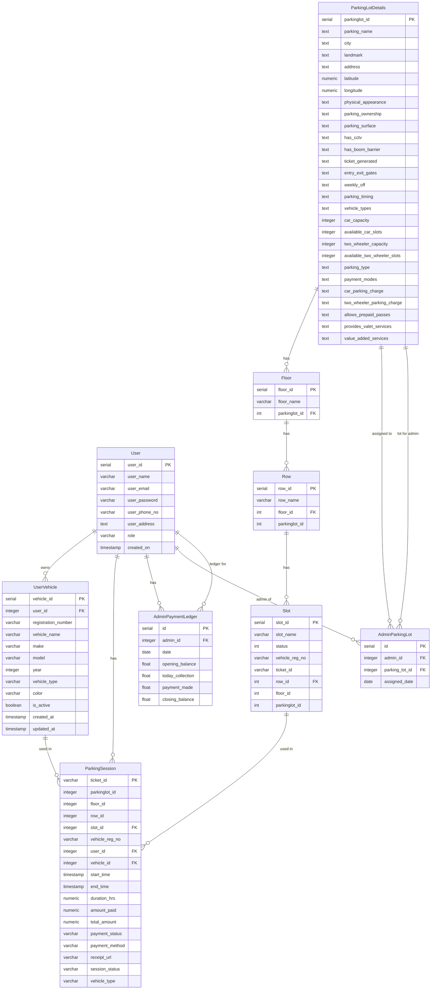

# Entity-Relationship Diagram (ERD)

> **Tip:** To view the ERD diagram below, use a Markdown preview extension that supports Mermaid diagrams (such as "Markdown Preview Mermaid Support" for VS Code, or enable Mermaid in your preferred Markdown viewer).

This diagram represents the relationships between tables in the Smart Parking backend database.

## Database Overview

**Total Tables**: 9

### Core Tables
1. **users** - User accounts (super_admin, admin, user)
2. **user_vehicles** - User-registered vehicles
3. **parkinglots_details** - 87 parking lots across New Delhi
4. **floors** - 3 floors per parking lot (Ground, First, Second)
5. **rows** - 4 rows per floor (Row-A, Row-B, Row-C, Row-D)
6. **slots** - 10 slots per row (S1-S10) = 10,440 total slots

### Transaction Tables
7. **parking_sessions** - Vehicle check-in/check-out records
8. **admin_parking_lots** - Admin-to-parking-lot assignments
9. **admin_payment_ledger** - Daily payment tracking for admins

## Entity Relationship Diagram

