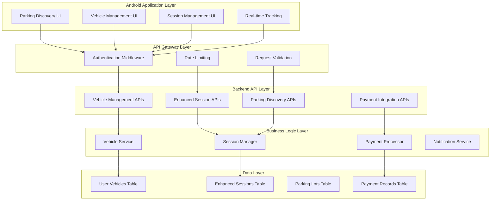
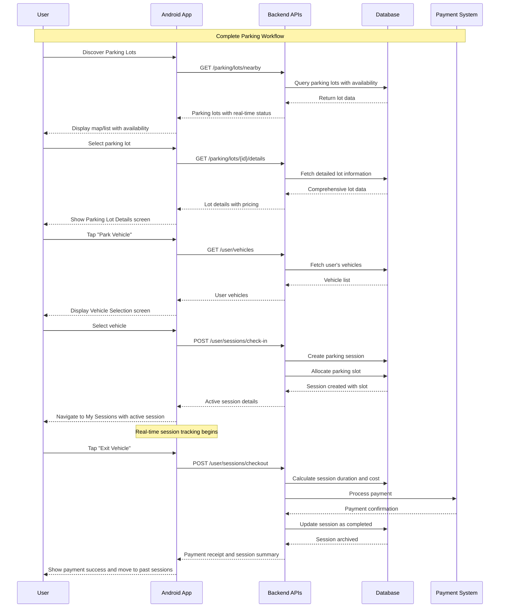
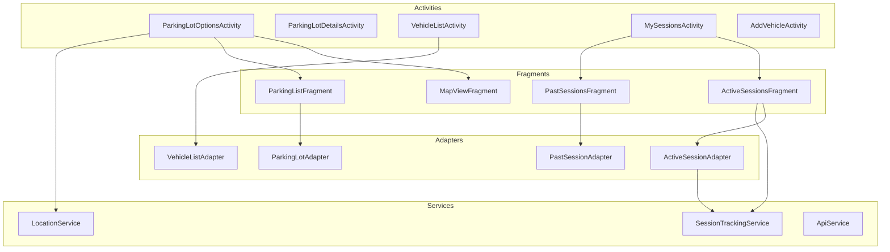

# Design Document

## Overview

The Vehicle Session Management system implements a comprehensive parking workflow spanning sections 4.4-4.6 of the Vision Parking PRD. The design encompasses both backend API enhancements and Android application development, enabling users to discover parking lots, manage vehicles, and track real-time parking sessions. The architecture supports parallel development of backend and frontend components while maintaining data consistency and user experience quality.

## Architecture

### High-Level System Architecture



### Component Integration Flow



## Backend API Design

### Database Schema Extensions

#### New User Vehicles Table
```sql
CREATE TABLE user_vehicles (
    vehicle_id SERIAL PRIMARY KEY,
    user_id INTEGER NOT NULL REFERENCES users(user_id) ON DELETE CASCADE,
    registration_number VARCHAR(20) NOT NULL,
    vehicle_name VARCHAR(100),
    make VARCHAR(50),
    model VARCHAR(50),
    year INTEGER,
    vehicle_type VARCHAR(20) DEFAULT 'car',
    color VARCHAR(30),
    is_active BOOLEAN DEFAULT true,
    created_at TIMESTAMP DEFAULT CURRENT_TIMESTAMP,
    updated_at TIMESTAMP DEFAULT CURRENT_TIMESTAMP,
    
    UNIQUE(user_id, registration_number)
);

CREATE INDEX idx_user_vehicles_user_id ON user_vehicles(user_id);
CREATE INDEX idx_user_vehicles_active ON user_vehicles(user_id, is_active);
```

#### Enhanced Parking Session Table
```sql
-- Add new columns to existing parking_session table
ALTER TABLE parking_session ADD COLUMN vehicle_id INTEGER REFERENCES user_vehicles(vehicle_id);
ALTER TABLE parking_session ADD COLUMN payment_status VARCHAR(20) DEFAULT 'pending';
ALTER TABLE parking_session ADD COLUMN payment_method VARCHAR(50);
ALTER TABLE parking_session ADD COLUMN total_amount DECIMAL(10,2);
ALTER TABLE parking_session ADD COLUMN receipt_url VARCHAR(255);
ALTER TABLE parking_session ADD COLUMN session_status VARCHAR(20) DEFAULT 'active';

CREATE INDEX idx_parking_session_user_vehicle ON parking_session(user_id, vehicle_id);
CREATE INDEX idx_parking_session_status ON parking_session(user_id, session_status);
```

### API Endpoint Specifications

#### Vehicle Management APIs

##### GET /user/vehicles
```python
@app.route('/user/vehicles', methods=['GET'])
@jwt_required()
def get_user_vehicles():
    """
    Retrieve all vehicles for authenticated user
    """
    user_id = get_jwt_identity()
    
    vehicles = db.session.query(UserVehicle).filter_by(
        user_id=user_id, 
        is_active=True
    ).all()
    
    return jsonify({
        "success": True,
        "data": [vehicle.to_dict() for vehicle in vehicles]
    })
```

##### POST /user/vehicles
```python
@app.route('/user/vehicles', methods=['POST'])
@jwt_required()
def create_vehicle():
    """
    Register a new vehicle for user
    """
    user_id = get_jwt_identity()
    data = request.get_json()
    
    # Validation
    required_fields = ['registration_number', 'vehicle_name']
    if not all(field in data for field in required_fields):
        return jsonify({"error": "Missing required fields"}), 400
    
    # Check for duplicate registration
    existing = UserVehicle.query.filter_by(
        user_id=user_id,
        registration_number=data['registration_number']
    ).first()
    
    if existing:
        return jsonify({"error": "Vehicle already registered"}), 409
    
    vehicle = UserVehicle(
        user_id=user_id,
        registration_number=data['registration_number'],
        vehicle_name=data['vehicle_name'],
        make=data.get('make'),
        model=data.get('model'),
        year=data.get('year'),
        vehicle_type=data.get('vehicle_type', 'car'),
        color=data.get('color')
    )
    
    db.session.add(vehicle)
    db.session.commit()
    
    return jsonify({
        "success": True,
        "data": vehicle.to_dict()
    }), 201
```

#### Enhanced Session APIs

##### POST /user/sessions/check-in
```python
@app.route('/user/sessions/check-in', methods=['POST'])
@jwt_required()
def session_checkin():
    """
    Start a new parking session with vehicle
    """
    user_id = get_jwt_identity()
    data = request.get_json()
    
    required_fields = ['vehicle_id', 'parkinglot_id']
    if not all(field in data for field in required_fields):
        return jsonify({"error": "Missing required fields"}), 400
    
    # Verify vehicle ownership
    vehicle = UserVehicle.query.filter_by(
        vehicle_id=data['vehicle_id'],
        user_id=user_id,
        is_active=True
    ).first()
    
    if not vehicle:
        return jsonify({"error": "Vehicle not found"}), 404
    
    # Check for existing active session
    active_session = ParkingSession.query.filter_by(
        user_id=user_id,
        vehicle_id=data['vehicle_id'],
        session_status='active'
    ).first()
    
    if active_session:
        return jsonify({"error": "Vehicle already has active session"}), 409
    
    # Allocate parking slot
    available_slot = allocate_parking_slot(data['parkinglot_id'])
    if not available_slot:
        return jsonify({"error": "No available parking slots"}), 409
    
    # Create session
    session = ParkingSession(
        ticket_id=generate_ticket_id(),
        user_id=user_id,
        vehicle_id=data['vehicle_id'],
        parkinglot_id=data['parkinglot_id'],
        slot_id=available_slot.slot_id,
        floor_id=available_slot.floor_id,
        row_id=available_slot.row_id,
        vehicle_reg_no=vehicle.registration_number,
        vehicle_type=vehicle.vehicle_type,
        start_time=datetime.utcnow(),
        session_status='active'
    )
    
    db.session.add(session)
    db.session.commit()
    
    return jsonify({
        "success": True,
        "data": {
            "ticket_id": session.ticket_id,
            "session_id": session.ticket_id,
            "parking_lot_name": get_parking_lot_name(data['parkinglot_id']),
            "slot_location": {
                "floor_name": available_slot.floor_name,
                "row_name": available_slot.row_name,
                "slot_name": available_slot.slot_name
            },
            "start_time": session.start_time.isoformat(),
            "vehicle_info": vehicle.to_dict(),
            "status": "active"
        }
    }), 201
```

##### POST /user/sessions/checkout
```python
@app.route('/user/sessions/checkout', methods=['POST'])
@jwt_required()
def session_checkout():
    """
    End parking session and process payment
    """
    user_id = get_jwt_identity()
    data = request.get_json()
    
    if 'ticket_id' not in data:
        return jsonify({"error": "Missing ticket_id"}), 400
    
    session = ParkingSession.query.filter_by(
        ticket_id=data['ticket_id'],
        user_id=user_id,
        session_status='active'
    ).first()
    
    if not session:
        return jsonify({"error": "Active session not found"}), 404
    
    # Calculate duration and cost
    end_time = datetime.utcnow()
    duration = end_time - session.start_time
    duration_hours = duration.total_seconds() / 3600
    
    # Get parking lot rates
    parking_lot = ParkingLotDetails.query.get(session.parkinglot_id)
    hourly_rate = get_hourly_rate(parking_lot, session.vehicle_type)
    total_amount = calculate_parking_cost(duration_hours, hourly_rate)
    
    # Process payment (integrate with payment gateway)
    payment_result = process_payment(
        user_id=user_id,
        amount=total_amount,
        payment_method=data.get('payment_method', 'card')
    )
    
    if not payment_result['success']:
        return jsonify({"error": "Payment processing failed"}), 402
    
    # Update session
    session.end_time = end_time
    session.duration_hrs = duration_hours
    session.total_amount = total_amount
    session.payment_status = 'completed'
    session.payment_method = payment_result['method']
    session.receipt_url = payment_result['receipt_url']
    session.session_status = 'completed'
    
    # Free up parking slot
    free_parking_slot(session.slot_id)
    
    db.session.commit()
    
    return jsonify({
        "success": True,
        "data": {
            "ticket_id": session.ticket_id,
            "start_time": session.start_time.isoformat(),
            "end_time": session.end_time.isoformat(),
            "duration": format_duration(duration_hours),
            "total_amount": float(total_amount),
            "payment_status": "completed",
            "receipt_url": session.receipt_url,
            "slot_location": get_slot_location(session.slot_id)
        }
    })
```

##### GET /user/sessions/active
```python
@app.route('/user/sessions/active', methods=['GET'])
@jwt_required()
def get_active_sessions():
    """
    Get all active sessions for user
    """
    user_id = get_jwt_identity()
    
    sessions = db.session.query(ParkingSession).filter_by(
        user_id=user_id,
        session_status='active'
    ).all()
    
    active_sessions = []
    for session in sessions:
        current_duration = datetime.utcnow() - session.start_time
        parking_lot = ParkingLotDetails.query.get(session.parkinglot_id)
        
        active_sessions.append({
            "ticket_id": session.ticket_id,
            "parking_lot_name": parking_lot.parking_name,
            "parking_lot_address": parking_lot.address,
            "vehicle_reg_no": session.vehicle_reg_no,
            "start_time": session.start_time.isoformat(),
            "current_duration": format_duration(current_duration.total_seconds() / 3600),
            "estimated_cost": calculate_current_cost(session),
            "slot_location": get_slot_location(session.slot_id)
        })
    
    return jsonify({
        "success": True,
        "data": active_sessions
    })
```

#### Enhanced Parking Lot APIs

##### GET /parking/lots/nearby (Enhanced)
```python
@app.route('/parking/lots/nearby', methods=['GET'])
@jwt_required()
def get_nearby_parking_lots():
    """
    Get nearby parking lots with enhanced filtering
    """
    latitude = float(request.args.get('latitude'))
    longitude = float(request.args.get('longitude'))
    radius = int(request.args.get('radius', 3000))  # 3km default
    
    # Optional filters
    max_price = request.args.get('max_price', type=float)
    min_availability = request.args.get('min_availability', type=int)
    vehicle_type = request.args.get('vehicle_type', 'car')
    
    # Query with distance calculation
    lots = db.session.query(ParkingLotDetails).filter(
        func.ST_DWithin(
            func.ST_Point(ParkingLotDetails.longitude, ParkingLotDetails.latitude),
            func.ST_Point(longitude, latitude),
            radius
        )
    )
    
    # Apply filters
    if max_price:
        lots = lots.filter(get_hourly_rate_filter(max_price, vehicle_type))
    
    results = []
    for lot in lots.all():
        availability = get_real_time_availability(lot.parkinglot_id, vehicle_type)
        
        if min_availability and availability < min_availability:
            continue
            
        distance = calculate_distance(latitude, longitude, lot.latitude, lot.longitude)
        
        results.append({
            "parkinglot_id": lot.parkinglot_id,
            "name": lot.parking_name,
            "address": lot.address,
            "latitude": float(lot.latitude),
            "longitude": float(lot.longitude),
            "distance": distance,
            "availability": availability,
            "availability_status": get_availability_status(availability),
            "hourly_rate": get_hourly_rate(lot, vehicle_type),
            "is_open": is_currently_open(lot.parking_timing)
        })
    
    # Sort by distance
    results.sort(key=lambda x: x['distance'])
    
    return jsonify({
        "success": True,
        "data": results
    })
```

## Android Application Design

### Architecture Components

#### Activity and Fragment Structure



### Key Android Components Implementation

#### 1. Enhanced Parking Lot Options Activity

```java
public class ParkingLotOptionsActivity extends AppCompatActivity implements OnMapReadyCallback {
    private GoogleMap mMap;
    private RecyclerView recyclerView;
    private ParkingLotAdapter adapter;
    private List<ParkingLot> parkingLots;
    private boolean isMapView = true;
    
    // UI Components
    private FloatingActionButton fabCurrentLocation;
    private FloatingActionButton fabFilter;
    private FloatingActionButton fabToggleView;
    private SearchView searchView;
    
    @Override
    protected void onCreate(Bundle savedInstanceState) {
        super.onCreate(savedInstanceState);
        setContentView(R.layout.activity_parking_lot_options);
        
        initializeComponents();
        setupMapFragment();
        setupRecyclerView();
        setupClickListeners();
        loadNearbyParkingLots();
    }
    
    private void setupClickListeners() {
        fabToggleView.setOnClickListener(v -> toggleMapListView());
        fabFilter.setOnClickListener(v -> showFilterDialog());
        fabCurrentLocation.setOnClickListener(v -> centerMapOnCurrentLocation());
    }
    
    private void toggleMapListView() {
        isMapView = !isMapView;
        if (isMapView) {
            showMapView();
            fabToggleView.setImageResource(R.drawable.ic_list);
        } else {
            showListView();
            fabToggleView.setImageResource(R.drawable.ic_map);
        }
    }
    
    private void showFilterDialog() {
        FilterDialogFragment dialog = new FilterDialogFragment();
        dialog.setFilterListener(new FilterListener() {
            @Override
            public void onFiltersApplied(FilterCriteria criteria) {
                applyFilters(criteria);
            }
        });
        dialog.show(getSupportFragmentManager(), "filter_dialog");
    }
    
    @Override
    public void onMapReady(GoogleMap googleMap) {
        mMap = googleMap;
        setupMapSettings();
        
        // FIX: Replace toast with navigation to details
        mMap.setOnMarkerClickListener(marker -> {
            ParkingLot lot = (ParkingLot) marker.getTag();
            if (lot != null) {
                navigateToParkingLotDetails(lot.getParkinglotId());
            }
            return true;
        });
    }
    
    private void navigateToParkingLotDetails(String lotId) {
        Intent intent = new Intent(this, ParkingLotDetailsActivity.class);
        intent.putExtra("parking_lot_id", lotId);
        startActivity(intent);
    }
    
    private void loadNearbyParkingLots() {
        showLoading(true);
        
        LocationManager.getCurrentLocation(this, new LocationCallback() {
            @Override
            public void onLocationReceived(Location location) {
                ApiService.getNearbyParkingLots(
                    location.getLatitude(),
                    location.getLongitude(),
                    3000, // 3km radius
                    new ApiCallback<List<ParkingLot>>() {
                        @Override
                        public void onSuccess(List<ParkingLot> lots) {
                            parkingLots = lots;
                            updateMapMarkers();
                            updateListView();
                            showLoading(false);
                        }
                        
                        @Override
                        public void onError(String error) {
                            showError(error);
                            showLoading(false);
                        }
                    }
                );
            }
        });
    }
}
```

#### 2. Parking Lot Details Activity

```java
public class ParkingLotDetailsActivity extends AppCompatActivity {
    private String parkingLotId;
    private ParkingLot parkingLot;
    
    // UI Components
    private ImageView ivHeroImage;
    private TextView tvParkingName, tvAddress, tvOperatingHours;
    private TextView tvPricingDetails, tvCapacity;
    private Button btnParkVehicle;
    private ProgressBar progressBar;
    
    @Override
    protected void onCreate(Bundle savedInstanceState) {
        super.onCreate(savedInstanceState);
        setContentView(R.layout.activity_parking_lot_details);
        
        parkingLotId = getIntent().getStringExtra("parking_lot_id");
        
        initializeViews();
        setupClickListeners();
        loadParkingLotDetails();
    }
    
    private void setupClickListeners() {
        btnParkVehicle.setOnClickListener(v -> {
            Intent intent = new Intent(this, VehicleListActivity.class);
            intent.putExtra("parking_lot_id", parkingLotId);
            intent.putExtra("parking_lot_name", parkingLot.getName());
            startActivity(intent);
        });
    }
    
    private void loadParkingLotDetails() {
        showLoading(true);
        
        ApiService.getParkingLotDetails(parkingLotId, new ApiCallback<ParkingLot>() {
            @Override
            public void onSuccess(ParkingLot lot) {
                parkingLot = lot;
                displayParkingLotInfo();
                showLoading(false);
            }
            
            @Override
            public void onError(String error) {
                showError(error);
                showLoading(false);
            }
        });
    }
    
    private void displayParkingLotInfo() {
        tvParkingName.setText(parkingLot.getName());
        tvAddress.setText(parkingLot.getAddress());
        tvOperatingHours.setText("Mon–Sun – " + parkingLot.getOperatingHours());
        
        // Display pricing information
        StringBuilder pricing = new StringBuilder();
        pricing.append("First hour: €").append(parkingLot.getFirstHourRate()).append("\n");
        pricing.append("Each additional hour: €").append(parkingLot.getHourlyRate()).append("\n");
        pricing.append("Daily max: €").append(parkingLot.getDailyMax());
        tvPricingDetails.setText(pricing.toString());
        
        tvCapacity.setText(parkingLot.getTotalSpaces() + " Total Parking Spaces");
        
        // Load hero image
        Glide.with(this)
            .load(parkingLot.getImageUrl())
            .placeholder(R.drawable.placeholder_parking)
            .into(ivHeroImage);
    }
}
```

#### 3. Vehicle List Activity

```java
public class VehicleListActivity extends AppCompatActivity {
    private RecyclerView recyclerView;
    private VehicleListAdapter adapter;
    private List<UserVehicle> vehicles;
    private Button btnAddVehicle;
    private String parkingLotId;
    private String parkingLotName;
    
    @Override
    protected void onCreate(Bundle savedInstanceState) {
        super.onCreate(savedInstanceState);
        setContentView(R.layout.activity_vehicle_list);
        
        parkingLotId = getIntent().getStringExtra("parking_lot_id");
        parkingLotName = getIntent().getStringExtra("parking_lot_name");
        
        initializeViews();
        setupRecyclerView();
        setupClickListeners();
        loadUserVehicles();
    }
    
    private void setupRecyclerView() {
        adapter = new VehicleListAdapter(vehicles, new VehicleClickListener() {
            @Override
            public void onVehicleSelected(UserVehicle vehicle) {
                startParkingSession(vehicle);
            }
        });
        
        recyclerView.setLayoutManager(new LinearLayoutManager(this));
        recyclerView.setAdapter(adapter);
    }
    
    private void setupClickListeners() {
        btnAddVehicle.setOnClickListener(v -> {
            Intent intent = new Intent(this, AddVehicleActivity.class);
            startActivityForResult(intent, REQUEST_ADD_VEHICLE);
        });
    }
    
    private void startParkingSession(UserVehicle vehicle) {
        showLoading(true);
        
        SessionCheckInRequest request = new SessionCheckInRequest(
            vehicle.getVehicleId(),
            parkingLotId
        );
        
        ApiService.startParkingSession(request, new ApiCallback<ParkingSession>() {
            @Override
            public void onSuccess(ParkingSession session) {
                // Start session tracking service
                SessionTrackingService.startTracking(VehicleListActivity.this, session);
                
                // Navigate to My Sessions
                Intent intent = new Intent(VehicleListActivity.this, MySessionsActivity.class);
                intent.putExtra("new_session_id", session.getTicketId());
                startActivity(intent);
                finish();
            }
            
            @Override
            public void onError(String error) {
                showError(error);
                showLoading(false);
            }
        });
    }
    
    private void loadUserVehicles() {
        ApiService.getUserVehicles(new ApiCallback<List<UserVehicle>>() {
            @Override
            public void onSuccess(List<UserVehicle> userVehicles) {
                vehicles.clear();
                vehicles.addAll(userVehicles);
                adapter.notifyDataSetChanged();
            }
            
            @Override
            public void onError(String error) {
                showError(error);
            }
        });
    }
}
```

#### 4. My Sessions Activity with Real-time Tracking

```java
public class MySessionsActivity extends AppCompatActivity {
    private RecyclerView recyclerViewActive;
    private ActiveSessionAdapter activeAdapter;
    private List<ActiveSession> activeSessions;
    private SessionTrackingService.SessionBinder sessionBinder;
    private ServiceConnection serviceConnection;
    
    @Override
    protected void onCreate(Bundle savedInstanceState) {
        super.onCreate(savedInstanceState);
        setContentView(R.layout.activity_my_sessions);
        
        initializeViews();
        setupRecyclerView();
        bindToSessionTrackingService();
        loadActiveSessions();
    }
    
    private void bindToSessionTrackingService() {
        serviceConnection = new ServiceConnection() {
            @Override
            public void onServiceConnected(ComponentName name, IBinder service) {
                sessionBinder = (SessionTrackingService.SessionBinder) service;
                sessionBinder.setSessionUpdateListener(new SessionUpdateListener() {
                    @Override
                    public void onSessionUpdated(ActiveSession session) {
                        runOnUiThread(() -> updateSessionInList(session));
                    }
                });
            }
            
            @Override
            public void onServiceDisconnected(ComponentName name) {
                sessionBinder = null;
            }
        };
        
        Intent intent = new Intent(this, SessionTrackingService.class);
        bindService(intent, serviceConnection, Context.BIND_AUTO_CREATE);
    }
    
    private void setupRecyclerView() {
        activeAdapter = new ActiveSessionAdapter(activeSessions, new SessionActionListener() {
            @Override
            public void onExitVehicle(String sessionId) {
                showCheckoutConfirmation(sessionId);
            }
        });
        
        recyclerViewActive.setLayoutManager(new LinearLayoutManager(this));
        recyclerViewActive.setAdapter(activeAdapter);
    }
    
    private void showCheckoutConfirmation(String sessionId) {
        ActiveSession session = findSessionById(sessionId);
        if (session == null) return;
        
        CheckoutConfirmationDialog dialog = new CheckoutConfirmationDialog(session);
        dialog.setCheckoutListener(new CheckoutListener() {
            @Override
            public void onConfirmCheckout(String sessionId) {
                processCheckout(sessionId);
            }
        });
        dialog.show(getSupportFragmentManager(), "checkout_dialog");
    }
    
    private void processCheckout(String sessionId) {
        showLoading(true);
        
        SessionCheckoutRequest request = new SessionCheckoutRequest(sessionId);
        
        ApiService.endParkingSession(request, new ApiCallback<PaymentInfo>() {
            @Override
            public void onSuccess(PaymentInfo paymentInfo) {
                // Stop tracking for this session
                if (sessionBinder != null) {
                    sessionBinder.stopTrackingSession(sessionId);
                }
                
                // Remove from active sessions
                removeSessionFromActive(sessionId);
                
                // Show payment success
                showPaymentSuccess(paymentInfo);
                showLoading(false);
            }
            
            @Override
            public void onError(String error) {
                showError(error);
                showLoading(false);
            }
        });
    }
    
    @Override
    protected void onDestroy() {
        super.onDestroy();
        if (serviceConnection != null) {
            unbindService(serviceConnection);
        }
    }
}
```

#### 5. Session Tracking Service

```java
public class SessionTrackingService extends Service {
    private Map<String, SessionTimer> activeTimers = new HashMap<>();
    private SessionUpdateListener updateListener;
    private Handler mainHandler = new Handler(Looper.getMainLooper());
    
    public class SessionBinder extends Binder {
        public void setSessionUpdateListener(SessionUpdateListener listener) {
            updateListener = listener;
        }
        
        public void stopTrackingSession(String sessionId) {
            SessionTimer timer = activeTimers.remove(sessionId);
            if (timer != null) {
                timer.stop();
            }
        }
    }
    
    public static void startTracking(Context context, ParkingSession session) {
        Intent intent = new Intent(context, SessionTrackingService.class);
        intent.putExtra("session_data", session);
        context.startService(intent);
    }
    
    @Override
    public int onStartCommand(Intent intent, int flags, int startId) {
        if (intent != null && intent.hasExtra("session_data")) {
            ParkingSession session = (ParkingSession) intent.getSerializableExtra("session_data");
            startTrackingSession(session);
        }
        return START_STICKY;
    }
    
    private void startTrackingSession(ParkingSession session) {
        SessionTimer timer = new SessionTimer(session, new TimerCallback() {
            @Override
            public void onTimerUpdate(ActiveSession updatedSession) {
                if (updateListener != null) {
                    mainHandler.post(() -> updateListener.onSessionUpdated(updatedSession));
                }
            }
        });
        
        activeTimers.put(session.getTicketId(), timer);
        timer.start();
    }
    
    @Override
    public IBinder onBind(Intent intent) {
        return new SessionBinder();
    }
    
    private static class SessionTimer {
        private ParkingSession session;
        private TimerCallback callback;
        private Handler handler = new Handler(Looper.getMainLooper());
        private Runnable timerRunnable;
        private boolean isRunning = false;
        
        public SessionTimer(ParkingSession session, TimerCallback callback) {
            this.session = session;
            this.callback = callback;
            
            timerRunnable = new Runnable() {
                @Override
                public void run() {
                    if (isRunning) {
                        updateSession();
                        handler.postDelayed(this, 1000); // Update every second
                    }
                }
            };
        }
        
        public void start() {
            isRunning = true;
            handler.post(timerRunnable);
        }
        
        public void stop() {
            isRunning = false;
            handler.removeCallbacks(timerRunnable);
        }
        
        private void updateSession() {
            long currentTime = System.currentTimeMillis();
            long duration = currentTime - session.getStartTime().getTime();
            
            ActiveSession activeSession = new ActiveSession(session);
            activeSession.setCurrentDuration(formatDuration(duration));
            activeSession.setEstimatedCost(calculateCurrentCost(duration));
            
            callback.onTimerUpdate(activeSession);
        }
    }
}
```

## Data Models

### Android Data Models

```java
public class UserVehicle implements Serializable {
    private int vehicleId;
    private String registrationNumber;
    private String vehicleName;
    private String make;
    private String model;
    private int year;
    private String vehicleType;
    private String color;
    
    // Constructors, getters, setters
    
    public String getDisplayName() {
        return vehicleName + " (" + registrationNumber + ")";
    }
    
    public String getVehicleDetails() {
        return make + " " + model + ", " + year;
    }
}

public class ActiveSession implements Serializable {
    private String ticketId;
    private String parkingLotName;
    private String address;
    private String vehicleRegNo;
    private Date startTime;
    private String currentDuration;
    private double estimatedCost;
    private SlotLocation slotLocation;
    
    // Real-time calculation methods
    public String getCurrentDuration() {
        long durationMillis = System.currentTimeMillis() - startTime.getTime();
        return formatDuration(durationMillis);
    }
    
    public double getCurrentCost() {
        long durationMillis = System.currentTimeMillis() - startTime.getTime();
        double hours = durationMillis / (1000.0 * 60 * 60);
        return Math.ceil(hours) * getHourlyRate();
    }
}

public class ParkingSession implements Serializable {
    private String ticketId;
    private int userId;
    private int vehicleId;
    private int parkinglotId;
    private Date startTime;
    private Date endTime;
    private double totalAmount;
    private String paymentStatus;
    private String sessionStatus;
    private SlotLocation slotLocation;
    
    // Getters and setters
}
```

## Error Handling and Edge Cases

### API Error Handling
```java
public class ApiErrorHandler {
    public static void handleApiError(int statusCode, String errorMessage, Context context) {
        switch (statusCode) {
            case 401:
                // Token expired, redirect to login
                redirectToLogin(context);
                break;
            case 409:
                // Conflict (e.g., vehicle already has active session)
                showUserFriendlyError(context, "You already have an active parking session for this vehicle");
                break;
            case 404:
                showUserFriendlyError(context, "Requested resource not found");
                break;
            case 500:
                showUserFriendlyError(context, "Server error. Please try again later");
                break;
            default:
                showUserFriendlyError(context, errorMessage);
        }
    }
}
```

### Session Conflict Resolution
```java
public class SessionConflictResolver {
    public static void handleActiveSessionConflict(Context context, String vehicleId) {
        AlertDialog.Builder builder = new AlertDialog.Builder(context);
        builder.setTitle("Active Session Found")
               .setMessage("This vehicle already has an active parking session. Would you like to view it?")
               .setPositiveButton("View Session", (dialog, which) -> {
                   Intent intent = new Intent(context, MySessionsActivity.class);
                   intent.putExtra("highlight_vehicle", vehicleId);
                   context.startActivity(intent);
               })
               .setNegativeButton("Cancel", null)
               .show();
    }
}
```

## Testing Strategy

### Backend API Testing
```python
# Test vehicle management
def test_create_vehicle():
    response = client.post('/user/vehicles', 
        json={'registration_number': 'TEST123', 'vehicle_name': 'Test Car'},
        headers={'Authorization': f'Bearer {auth_token}'})
    assert response.status_code == 201
    assert response.json['data']['registration_number'] == 'TEST123'

def test_session_checkin():
    response = client.post('/user/sessions/check-in',
        json={'vehicle_id': 1, 'parkinglot_id': 1},
        headers={'Authorization': f'Bearer {auth_token}'})
    assert response.status_code == 201
    assert 'ticket_id' in response.json['data']
```

### Android Unit Testing
```java
@Test
public void testSessionDurationCalculation() {
    Date startTime = new Date(System.currentTimeMillis() - 3600000); // 1 hour ago
    ActiveSession session = new ActiveSession();
    session.setStartTime(startTime);
    
    String duration = session.getCurrentDuration();
    assertTrue(duration.contains("1 hr"));
}

@Test
public void testVehicleValidation() {
    UserVehicle vehicle = new UserVehicle();
    vehicle.setRegistrationNumber("");
    
    assertFalse(VehicleValidator.isValid(vehicle));
}
```

This comprehensive design covers all aspects needed to implement sections 4.4-4.6 of your Vision Parking application, with clear separation between backend and Android development tracks for parallel implementation.