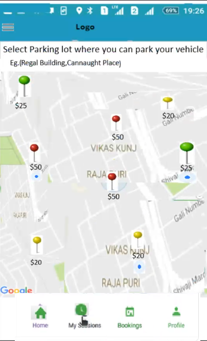
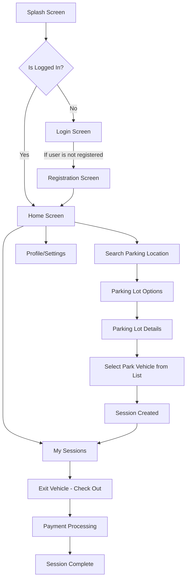
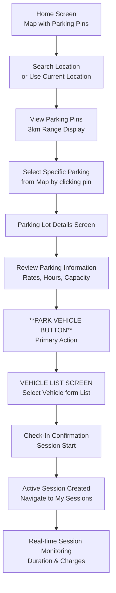
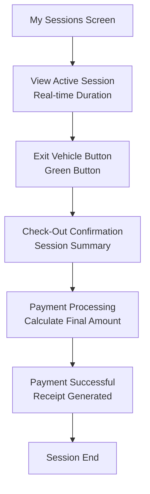
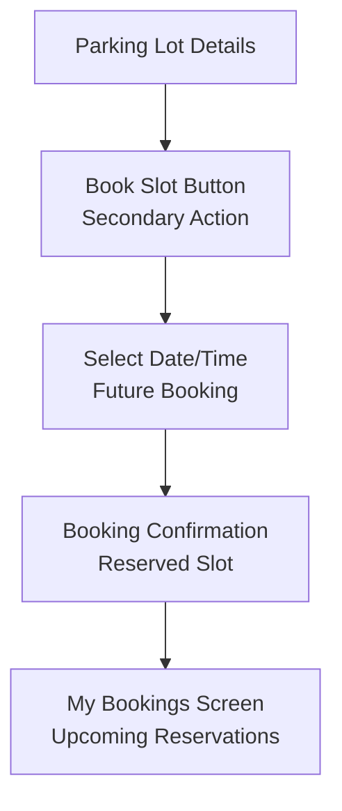
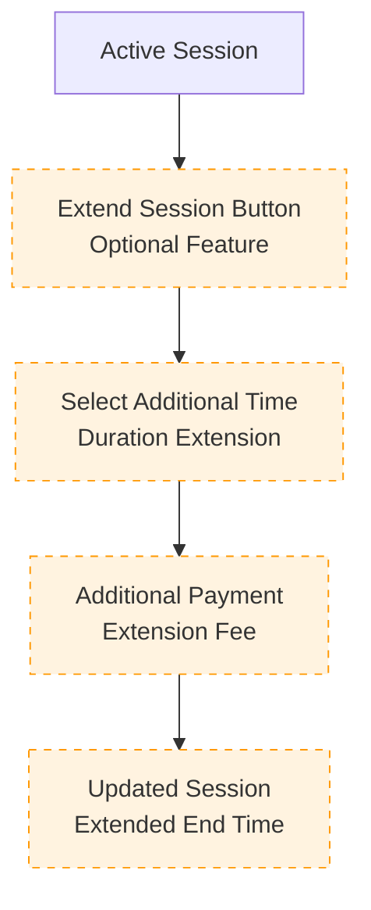

# Vision Parking App - Frontend UI PRD

## Overview

**Vision Parking App** is a native Android application (Java-based) that provides real-time parking availability through an intuitive search interface. The app enables users to find parking spots, check in/out of parking sessions, explore parking details, and manage their parking history. This app integrates with Google Maps APIs and supports both active parking sessions and booking functionality. This document outlines the **frontend design, UI flow**, and **API integration strategy** for Android Studio. The backend server (Flask + REST API) is already implemented and will be integrated after the UI is complete.

---

## 1. Objectives

- Design intuitive and responsive UI screens with focus on core parking management features.
- Create smooth user navigation through all functional modules.
- Implement real-time parking session management (active check-in/checkout).
- Integrate UI with existing Flask-based REST APIs (when available).
- Use placeholders/mock data for screens where APIs are pending or optional.

---

## 2. Core Features

Based on the application requirements, the following key features will be implemented:

### Primary Features

- **Login/Registration**: User authentication and account management
- **Searching**: Dialog-based search functionality on home screen for finding parking locations
- **Booking**: Reserve parking spots with date/time selection
- **Active Sessions**: Real-time management of current parking sessions with check-in/checkout
- **Past Sessions**: Historical view of completed parking sessions

### Secondary Features

- **Explore Parking Details**: Detailed information about parking locations including availability and pricing
- **Navigation**: Integration with maps for route guidance to parking locations

## 3. Target Platform

- **Platform**: Android
- **Language**: Java
- **IDE**: Android Studio
- **Minimum SDK**: 24+
- **UI Toolkit**: Android XML Layouts with Material Components

---

## 4. UI Screens and Flows

### 4.1 Splash Screen


**Target Design Reference**: Use the above image as the design template for the splash screen implementation.

**Functionality**:

- App logo with animation with Get Started button which redirects user to registration/login page.
- Navigates to Login or Home based on token existence

**Design Elements**:

- Follow the visual design shown in the reference image
- Implement the layout, colors, and styling as per the target design
- Ensure responsive design for different screen sizes

---

### 4.2 Authentication

#### Login Screen


**Target Design Reference**: Use the above image as the design template for the login screen implementation.

**Functionality**:

- Fields: Email, Password
- Buttons: Login, Register (redirects to Registration)
- Token saved locally on success (for auto-login)

**Design Elements**:

- Follow the visual design shown in the reference image
- Implement the layout, colors, and styling as per the target design
- Ensure responsive design for different screen sizes

#### Registration Screen


**Target Design Reference**: Use the above image as the design template for the registration screen implementation.

**Functionality**:

- Fields: Name, Email, Phone, Password, Address
- Button: Register
- On success: redirects to Login or Home

**Design Elements**:

- Follow the visual design shown in the reference image
- Implement the layout, colors, and styling as per the target design
- Ensure responsive design for different screen sizes

---

### 4.3 Home Screen


**Target Design Reference**: Use the above images as the design templates for the home screen implementation. Both variations show different approaches to the home screen layout.

**Functionality**:

- **Header Section**:

  - Hamburger menu icon (top-left) to open navigation sidebar
  - App title/logo in center

- **Search Section**:

  - Search Bar with location text input and search icon
  - Dialog-based search functionality for finding parking locations
  - "Use Current Location" button with location icon
  - Filter/settings icon for search preferences

- **Map View**:

  - Full-screen embedded Google Map View showing nearby parking lots
  - Interactive map with zoom controls
  - Parking location pins with color-coded availability status:
    - Green: Available spots
    - Yellow: Limited availability
    - Red: Full/No availability
  - Current user location marker
  - Distance indicators for parking locations

- **Navigation Sidebar** (accessible via hamburger menu):

  - User profile section with name and profile picture
  - Menu items:
    
    - Vehicles        
    - My Sessions
    - Bookings      **New Feature**      
    - Payments
    - My Permit
    - Favorites
    - Settings
    - Help & Support
    - Logout

- **Bottom Navigation Bar**:

  - Home (current screen)
  - My Sessions         **New Feature**
  - Bookings
  - Profile

- **Interactive Elements**:
  - Tap on parking pins to view quick info popup toast message of Parking Lot List screen
  - Swipe gestures for map navigation
  - Pull-to-refresh functionality for real-time updates

**Design Elements**:

- Follow the visual design shown in the reference images
- Implement the layout, colors, and styling as per the target design
- Choose the most appropriate design variation or combine elements from both
- Ensure responsive design for different screen sizes
- Maintain consistency with the overall app design language

---
# Parking Flow – Product Requirements Document (PRD)

---

## 4.4 Parking Lot Options (Map View & List Screen)


**Target Design Reference:**  
Use *ParkingLotOptions.png* as the design template for this screen.  
This serves as the **entry point** for users to discover nearby parking lots via a **map-based interface** and transition into detailed lot views.

---

### Functionality Overview

The **Parking Lot Options** screen allows users to search for available parking lots, explore real-time availability and pricing, and navigate to the **Parking Lot Details** screen by tapping any parking pin.  
This view combines **map interactivity** with **dynamic data updates** for seamless exploration.

---

### Core Features

#### 1. Map-Based Display
- Primary layout: full-screen **Google Map view**.
- Each pin represents a parking lot and displays:
  - **Lot name** (on selection or hover)
  - **Availability status (color-coded)**  
- **Pin Colors (Status Indicator):**
  - 🟢 **Green:** Available (>5 spots)
  - 🟡 **Yellow:** Limited (1–5 spots)
  - 🔴 **Red:** Full (0 spots)

#### 2. Real-Time Data Integration
- Live API updates every **30 seconds** for:
  - Availability  
  - Operational status  
- Smooth UI refresh with **skeleton placeholders** during updates.

#### 3. Search and Filter
- **Search Bar** integrated below the top app bar:
  - Allows search by parking lot name, area, or landmark.
  - Left icon: location marker.  
  - Right icon: clear text button.
- **Floating Action Buttons (right-side vertical stack):**
  - 📍 **Use Current Location** – recenters map on user’s position.
  - 🧭 **Filter** – opens modal/drawer with:
    - Price range slider  
    - Distance radius (1–10 km)  
    - Availability (Available / Limited / Full)  
    - Facility type (Covered / Open / Multi-level)  
    - Amenities (EV charging, Security, 24/7 access)
  - 🗂️ **List View Toggle** – switches between **Map View** and **List View**.

#### 4. List View Mode
- Each parking lot appears as a **card** showing:
  - Lot name  
  - Address  
  - Availability badge  
  - Star rating  
- Tapping a card opens the **Parking Lot Details** screen.

---

### User Interactions

| User Action | System Response |
|--------------|-----------------|
| Tap on parking pin | Opens **Parking Lot Details** |
| Tap “Use Current Location” | Re-centers map to current position |
| Apply filters/sort | Updates visible parking pins |
| Pull-to-refresh | Refreshes map and lot data |
| Toggle Map/List | Switches between map and list mode |

---

### Design Specifications

#### Color Scheme
- **Primary Color:** App green (#4CAF50)
- **Status Colors:**  
  - Green (#4CAF50) — Available  
  - Yellow (#FFC107) — Limited  
  - Red (#F44336) — Full  
- **Map Background:** Standard Google Maps neutral tone  
- **Card Background:** White (#FFFFFF)

#### Typography
- Lot name: Bold, 16sp  
- Address: Regular, 14sp (gray)  
- Distance & availability: Medium, 12sp  
- Button text: Medium, 14sp (white)

#### Layout & Spacing
- Map: Full-screen with floating components (FABs on right)  
- Search bar: Rounded, below app header  
- Margins: 16dp outer padding  
- Buttons: Circular FABs (elevation 2dp)

#### Icons
- Location pin: GPS recenter  
- Filter: Filter modal  
- List: Toggle list view  
- Star: Ratings  

---

### Navigation Flow
1. User opens **Parking Lot Options** (default home view).  
2. Taps on a **parking pin** to view lot details.  
3. System navigates to **Parking Lot Details** (*Section 4.5*).  
4. From there, the user taps **“Park Vehicle”** → goes to **Vehicle List Activity** (*Section 4.5.1*).

---

> **Note:**  
> The current design includes the search bar, filters, and view toggle as floating actions. Price tags on map pins and mini info cards have been removed in this version.

---

## 4.5 Parking Lot Details (Explore Parking Details)
.png)

**Target Design Reference:**  
Use *ParkingLot(new1).png* as the design reference.  
This screen displays complete details for the selected parking lot and allows the user to begin a parking session.

---

### Functionality Overview

The **Parking Lot Details** screen provides comprehensive information about the selected parking area — including operating hours, pricing tiers, and total capacity.  
It acts as a **decision point** where users can confirm and start a parking session.

---

### Screen Structure

#### 1. Header
- **Back Arrow (←)** — returns to the **Parking Lot Options** screen.  
- Minimal header design; no explicit title or share/favorite icons.  
- White background with subtle divider shadow.

#### 2. Parking Preview Image
- Static banner image showing the parking area or vehicles (hero section).  
- Serves as a visual identifier for the selected lot.  
- Appears at the top of the screen.

#### 3. Parking Information Card
- **Lot Name:** Prominent title text (e.g., *Stephcngarage*)  
- **Address:** Displayed below the name (e.g., *Kronenstrape*)  
- **Section Divider:** Thin line separating general info from details.  
- **Operating Hours Section:**  
  - Label: *Operating Hours*  
  - Text: *Mon–Sun – 24 Hours*  
  - Small icon beside heading (table/calendar style visual indicator).  

#### 4. Pricing Details
- **Section Header:** *Price* (with a small table/list icon).  
- Textual pricing breakdown:  
  - Short-term parker: First hour €3.00  
  - Each additional hour: €3.00  
  - Daily max: €14.00  
  - Last ticket: €28.00  
  - Evening rate (20:30–06:00): max €6.00  
- Simple list-style layout (no cards or icons).  

#### 5. Capacity Section
- Displays total parking spots (e.g., *318 Total Parking Spaces*).  
- Small car icon displayed beside capacity text.  
- Positioned directly below pricing section.

#### 6. Primary Action
- **“Park Vehicle”** button at the bottom of the screen.  
  - Full-width, high-contrast green (#4CAF50)  
  - White text, medium weight  
  - Rounded corners (8dp)  
  - On tap → navigates to **Vehicle List Activity** (*Section 4.5.1*).

---

### User Interactions

| User Action | System Response |
|--------------|-----------------|
| Tap Back | Returns to Parking Lot Options |
| Pull-to-refresh | Updates parking lot details |
| Tap “Park Vehicle” | Opens Vehicle List Activity |

---

### Design Specifications

#### Color Scheme
- **Primary:** Green (#4CAF50)  
- **Background:** White (#FFFFFF)  
- **Text Colors:**  
  - Primary text: Black (#212121)  
  - Secondary: Gray (#757575)

#### Typography
- Lot name: Bold, 24sp  
- Section headers: Medium, 18sp  
- Body text: Regular, 16sp  
- Sub-labels: Regular, 14sp  
- Buttons: Medium, 16sp (white text)

#### Layout & Spacing
- Screen margins: 16dp  
- Section spacing: 12dp  
- Card padding: 16dp  
- Components arranged in a vertical scroll layout (ScrollView)  
- Consistent divider lines between sections  

#### Icons
- Clock/Calendar: Operating hours section  
- Table/List icon: Pricing section  
- Car icon: Capacity indicator  

---

### Navigation Flow
1. User taps a parking pin on **Parking Lot Options**.  
2. Navigates to **Parking Lot Details** (lot info displayed).  
3. Taps **“Park Vehicle”** → opens **Vehicle List Activity** (*Section 4.5.1*).

---

> **Note:**  
> This version removes “Share”, “Favorite (Heart)”, “Amenities Grid”, and “Reviews” sections.  
> Currency updated to **€**, and the layout simplified to match the current build’s text-based presentation.

---

## 4.5.1 Vehicle List Activity (Select or Add Vehicle)
.png)
**Target Design Reference:**  
Use *VehicleListScreen(new).png* as the design template.  
This screen serves as the **vehicle selection gateway** before initiating a parking session.

---

### Functionality Overview

After tapping **“Park Vehicle”** on the **Parking Lot Details** screen, the user is directed to the **Vehicle List Activity**.  
Here, they can **select an existing vehicle** from their list or **add a new one** before confirming and starting a session.

---

### Screen Structure

#### 1. Header
- Back arrow (←) — returns to **Parking Lot Details** screen.  
- Title: **“My Vehicles”** centered.  
- White background with subtle bottom shadow.

#### 2. Vehicle List
- Displays user’s registered vehicles as individual **cards**.  
- Each vehicle card includes:
  - **Vehicle Name/Label** (e.g., “Primary Sedan”)  
  - **Registration Number** (e.g., “MH 12 AB 3456”)  
  - **Make & Model, Year** (e.g., “Honda City, 2020”)  
  - Vehicle icon on left.  
- Tapping a card **selects the vehicle** and proceeds to **start a parking session** (navigates to **My Sessions** screen).

#### 3. Add New Vehicle
- **Add New Vehicle** button (full-width, at bottom).  
  - Color: Green (#4CAF50)  
  - Rounded corners (8dp radius)  
  - On tap:
    - Opens **Add Vehicle Form** modal or screen.  
    - After successful addition, returns to updated vehicle list.

---

### User Interactions

| User Action | System Response |
|--------------|-----------------|
| Tap on “Park Vehicle” in Parking Lot Details | Navigates to Vehicle List Activity |
| Tap on an existing vehicle card | Starts a parking session for that vehicle and navigates to **My Sessions** screen |
| Tap “Add New Vehicle” | Opens Add Vehicle Form |
| Tap Back | Returns to Parking Lot Details |

---

### Design Specifications

#### Color Scheme
- **Primary:** Green (#4CAF50)  
- **Background:** White (#FFFFFF)  
- **Card Text Colors:**  
  - Primary: Black (#212121)  
  - Secondary: Gray (#757575)

#### Typography
- Screen Title: Bold, 20sp  
- Vehicle Name: Bold, 16sp  
- Vehicle Number & Details: Regular, 14sp  
- Button Text: Medium, 14sp (white)

#### Layout & Spacing
- Outer padding: 16dp  
- Card padding: 16dp  
- Element spacing: 8dp  
- Rounded corners: 12dp for cards  
- Card elevation: 2dp  

#### Icons
- Car icon for vehicle cards  
- Plus (+) icon for Add Vehicle button  

---

### Navigation Flow
1. User taps **“Park Vehicle”** on Parking Lot Details.  
2. Navigates to **Vehicle List Activity**.  
3. Selects an existing vehicle → system creates session.  
4. Redirects to **My Sessions (Section 4.6)** showing active session details.  
5. Alternatively, user can add a new vehicle before proceeding.

---
## 4.6 My Sessions (Unified Session Screen)
.png)

**Target Design Reference:**  
Use *MySessions(new).png* as the design template.  
This screen displays **all ongoing and recent parking sessions** in a single, scrollable list — replacing the previous Active/Past tab structure.

---

### Functionality Overview

The **My Sessions** screen provides a consolidated summary of all current and recently completed parking sessions.  
Each active session appears as an individual **card**, showing its key details such as location, time, and payment progress.

Users can:
1. View multiple concurrent sessions at once.  
2. End a specific session using the **“Exit Vehicle”** button.  
3. Access this screen:
   - Automatically after starting a session (from *Vehicle List Activity*), or  
   - Manually via the **My Sessions** tab in bottom navigation.

---

### Screen Structure

#### 1. Header
- Title: **“My Sessions”** centered.  
- (Optional) Back arrow if navigated from another screen.  
- White background with subtle divider shadow.

#### 2. Session Card (Repeating Component)
Each active or recent session is represented as a card containing:

- **Parking Lot Information:**
  - Lot Name: Bold (e.g., *Stuttgart, Stephangarage*)  
  - Address: Smaller gray text  
  - Optional chevron (>) for expandable details

- **Session Details:**
  - Optional **Session ID** (e.g., `#11235532233`)  
  - **Elapsed Time:** e.g., “47 mins”  
  - **Start/End Time:** e.g., “2010 – 16.00 hrs”  
  - **Charges:** e.g., “Amount: ₹40” or “₹40 so far” (dynamic or static depending on state)

- **Action Button:**
  - **“Exit Vehicle”**
    - Right-aligned inside card  
    - Color: Green (#4CAF50), White text  
    - Rounded corners (8dp)  
    - Ends session and processes payment

---

### Design Specifications

- **Background:** Light gray (#F5F5F5)  
- **Card Background:** White (#FFFFFF)  
- **Primary Color:** Green (#4CAF50)  
- **Typography:**
  - Title: 20sp bold  
  - Lot Name: 16sp bold  
  - Address & Details: 14sp regular  
  - Button Text: 14sp medium (white)
- **Spacing:**  
  - Card padding: 16dp  
  - Card margin: 8–12dp  
  - Elevation: 2dp  

---

### User Interactions

| User Action | System Response |
|--------------|-----------------|
| Tap “Exit Vehicle” | Ends only that specific session and finalizes payment |
| Pull-to-refresh | Updates all active sessions |
| Tap card | Expands for more session details |
| Tap “My Sessions” in nav bar | Opens this multi-session view |

---

### Technical Implementation

- **Fragment:** `MySessionsFragment`  
- **RecyclerView:** Displays multiple session cards  
- **Live Timer Service:** Updates durations every minute  
- **API Integration:**  
  - Create, end, and retrieve all sessions  
- **Caching:** Stores last known sessions for offline access  
- **Performance:** Auto-refresh every 30 seconds

---

### Navigation Flow Summary

1. User starts parking → navigates to **My Sessions**.  
2. Each session appears as a separate card.  
3. “Exit Vehicle” ends that session individually.  
4. Multiple sessions can remain active concurrently.  

---

### 4.7 Booking Screen

- Select:
  - Date and Time (start and end)
  - Duration auto-calculated
- Show:
  - Estimated cost
  - Booking summary
- Button: "Confirm Booking"
- On success: navigate to Booking Confirmation

---

### 4.8 Booking Confirmation

- Display:
  - Booking ID
  - Date, time, slot info
  - QR code (optional)
- Button: "Go to My Bookings"

---

### 4.9 My Bookings

- Tabs: Upcoming, Past
- List of reservations:
  - Date/time, location, status
- Click: View details / Cancel if applicable

---

### 4.10 Track & Navigate

- Open Google Maps with destination prefilled
- Show:
  - ETA
  - Current route from user location to lot

---

### 4.11 Payment Screen

- Fields:
  - Card/UPI input or redirect to payment provider
  - Payment method selection
- Confirmation on success/failure

---

### 4.12 Rate & Review Screen

- Rate using stars (1 to 5)
- Optional: text review, upload image
- Show average rating

---

### 4.13 Profile / Settings

- Display:
  - User Info
  - Saved payment methods (if supported)
- Actions:
  - Edit profile
  - Logout

---

## 5. Activity Flow/Navigation Flow

### 5.1 Primary Application Flow (Core Features)

**PRIMARY FOCUS**: The main user journey centers around the "Park Vehicle" check-in flow through the Parking Lot Details screen.



### 5.2 PRIMARY USE CASE: Park Vehicle Check-In Flow

**Core User Journey**: Home Screen → Search Location → Select Parking → Parking Details → **Park Vehicle**



### 5.3 SECONDARY USE CASE: Exit Vehicle Check-Out Flow

**Flow**: My Sessions → Active Tab → Exit Vehicle → Payment → Complete



### 5.4 FUTURE SCOPE FEATURES (Secondary Priority)

#### 5.4.1 Booking Feature (Future Implementation)


#### 5.4.2 Session Extension Feature (Future Implementation)


### 5.5 Detailed Navigation Steps (Primary Flow)

#### CORE: Park Vehicle Check-In Process

1. **Home Screen (Map View)**
   - Display current location with nearby parking pins
   - Color-coded availability indicators (Green/Yellow/Red)
   - Search functionality for specific locations

2. **Location Search & Selection**
   - Search bar for address/location input
   - "Use Current Location" button
   - 3km radius parking display
   - Interactive map with parking pins

3. **Parking Selection**
   - Tap on parking pin or select from list
   - View basic info popup
   - Navigate to detailed view

4. **Optional Navigation**
   - Google Maps integration for directions
   - ETA and route information
   - Return to app after reaching location

5. **Parking Lot Details Screen** ⭐ **KEY SCREEN**
   - Complete parking information display
   - Real-time availability and pricing
   - Operating hours and amenities
   - **"Park Vehicle" button - PRIMARY ACTION**

6. **Park Vehicle Check-In**
   - Tap "Park Vehicle" button
   - Confirmation dialog with session details
   - Session creation and timer start
   - Automatic navigation to My Sessions

7. **Active Session Management**
   - Real-time duration tracking
   - Live charge calculation
   - Session status monitoring
   - Access via My Sessions → Active tab

#### CORE: Exit Vehicle Check-Out Process

1. **Access My Sessions**
   - Navigate from bottom navigation or home
   - Default to Active tab

2. **View Active Session**
   - Real-time session information
   - Current duration and charges
   - Location details

3. **Exit Vehicle Process**
   - Tap "Exit Vehicle" button
   - Review session summary
   - Confirm final charges

4. **Payment & Completion**
   - Process payment transaction
   - Generate digital receipt
   - Archive session to Past tab

### 5.6 Implementation Priority

#### Phase 1 (MVP - Core Features)
1. ✅ **Park Vehicle Check-In Flow** (Primary)
2. ✅ **Exit Vehicle Check-Out Flow** (Primary)
3. ✅ **My Sessions Management** (Active/Past tabs)
4. ✅ **Parking Lot Details Screen** (Key decision point)
5. ✅ **Home Screen with Map Integration**

#### Phase 2 (Future Enhancements)
1. 🔄 **Booking System** (Advanced reservations)
2. 🔄 **Session Extension** (Duration extension)
3. 🔄 **Advanced Payment Options**
4. 🔄 **Push Notifications**
5. 🔄 **Loyalty Programs**


---
```mermaid
sequenceDiagram
    title Vehicle Select Activity
    
    participant Android
    participant Backend

    note over Android: In Parking Lot Details Activity On clicking Park Vehicle Button
    Android->>Backend: GET all Vehicle details(userID)
    Android->>Backend: POST new Vehicle(optional)
    Android->>Backend: Start a Session
    note over Android: Display Session Activity with new session