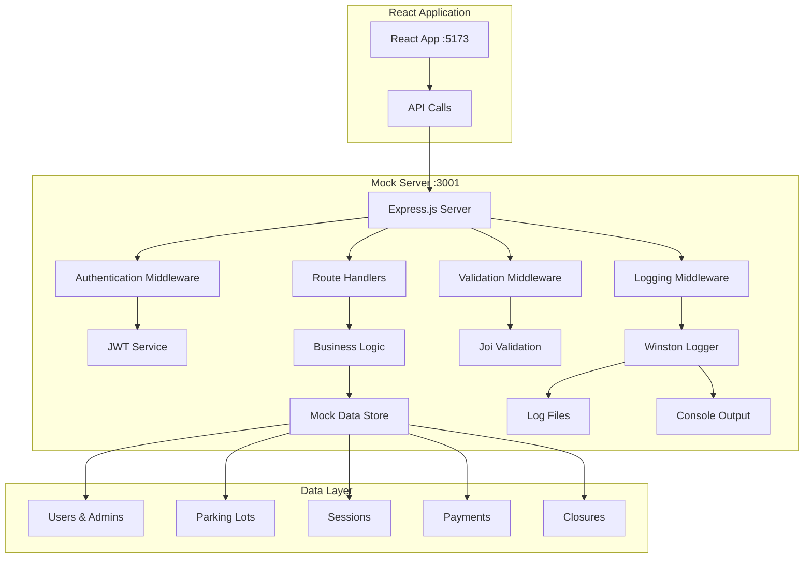

# Mock Server Design Document

## Overview

The Mock Server is a comprehensive Node.js application built with Express.js that provides realistic REST API endpoints for testing the Parking Admin Dashboard React application. The server operates independently, generates 3 months of mock data, implements comprehensive logging and tracing, and supports all required API endpoints with proper authentication and authorization.

## Architecture

### High-Level Architecture



### Technology Stack

- **Runtime**: Node.js 18+
- **Framework**: Express.js 4.x
- **Authentication**: JSON Web Tokens (JWT)
- **Logging**: Winston with daily rotation
- **Validation**: Joi schema validation
- **Security**: Helmet.js, CORS, Rate limiting
- **Testing**: Jest, Supertest
- **Documentation**: Swagger/OpenAPI

### Project Structure

```
mock-server/
├── package.json                 # Dependencies and scripts
├── server.js                    # Main server entry point
├── .env                         # Environment configuration
├── .env.example                 # Environment template
├── README.md                    # Setup and usage documentation
├── config/
│   ├── database.js              # Mock database configuration
│   ├── logging.js               # Winston logger configuration
│   ├── server.config.js         # Server settings and middleware
│   └── swagger.js               # API documentation configuration
├── data/
│   ├── generators/              # Data generation utilities
│   │   ├── userGenerator.js     # User and admin data generation
│   │   ├── lotGenerator.js      # Parking lot data generation
│   │   ├── sessionGenerator.js  # Session data generation
│   │   ├── paymentGenerator.js  # Payment data generation
│   │   └── closureGenerator.js  # Daily closure data generation
│   ├── mockData.js              # Centralized mock data store
│   ├── seedData.js              # Data seeding utilities
│   └── relationships.js         # Data relationship management
├── routes/
│   ├── auth.js                  # Authentication endpoints
│   ├── admin.js                 # Admin management endpoints
│   ├── sessions.js              # Session management endpoints
│   ├── payments.js              # Payment processing endpoints
│   ├── closure.js               # Daily closure endpoints
│   ├── health.js                # Health check endpoints
│   └── index.js                 # Route aggregation
├── middleware/
│   ├── auth.js                  # JWT authentication middleware
│   ├── rbac.js                  # Role-based access control
│   ├── logging.js               # Request/response logging
│   ├── validation.js            # Input validation middleware
│   ├── errorHandler.js          # Centralized error handling
│   ├── rateLimit.js             # Rate limiting configuration
│   └── cors.js                  # CORS configuration
├── utils/
│   ├── logger.js                # Winston logger setup
│   ├── jwt.js                   # JWT utilities
│   ├── validators.js            # Validation schemas
│   ├── helpers.js               # General utilities
│   ├── constants.js             # Application constants
│   └── dateUtils.js             # Date manipulation utilities
├── services/
│   ├── authService.js           # Authentication business logic
│   ├── adminService.js          # Admin management logic
│   ├── sessionService.js        # Session management logic
│   ├── paymentService.js        # Payment processing logic
│   └── closureService.js        # Daily closure logic
├── logs/                        # Log files directory
│   ├── access.log               # Access logs
│   ├── error.log                # Error logs
│   ├── api-trace.log            # API tracing logs
│   └── performance.log          # Performance metrics
├── tests/
│   ├── unit/                    # Unit tests
│   │   ├── auth.test.js
│   │   ├── admin.test.js
│   │   ├── sessions.test.js
│   │   └── payments.test.js
│   ├── integration/             # Integration tests
│   │   ├── workflows.test.js
│   │   └── endpoints.test.js
│   ├── load/                    # Load testing
│   │   └── performance.test.js
│   └── fixtures/                # Test data fixtures
│       └── testData.js
├── docs/
│   ├── api/                     # API documentation
│   │   ├── swagger.yaml
│   │   └── endpoints.md
│   ├── deployment/              # Deployment guides
│   │   ├── setup.md
│   │   └── production.md
│   └── development/             # Development guides
│       ├── contributing.md
│       └── testing.md
└── scripts/
    ├── start.js                 # Server startup script
    ├── seed.js                  # Data seeding script
    ├── reset.js                 # Data reset script
    └── deploy.js                # Deployment script
```

## Components and Interfaces

### Core Server Components

#### 1. Express Server Configuration

```javascript
// Server configuration interface
const serverConfig = {
  port: process.env.PORT || 3001,
  host: process.env.HOST || 'localhost',
  cors: {
    origin: process.env.REACT_APP_URL || 'http://localhost:5173',
    credentials: true,
    methods: ['GET', 'POST', 'PUT', 'DELETE', 'OPTIONS'],
    allowedHeaders: ['Content-Type', 'Authorization']
  },
  rateLimit: {
    windowMs: 15 * 60 * 1000, // 15 minutes
    max: 1000, // requests per window
    message: 'Too many requests from this IP'
  },
  security: {
    helmet: true,
    compression: true,
    jsonLimit: '10mb'
  }
};
```

#### 2. Authentication System

```javascript
// JWT configuration
const jwtConfig = {
  secret: process.env.JWT_SECRET || 'mock-server-secret-key',
  expiresIn: process.env.JWT_EXPIRES_IN || '24h',
  refreshExpiresIn: '7d',
  algorithm: 'HS256'
};

// User authentication interface
interface AuthUser {
  user_id: number;
  username: string;
  user_email: string;
  role: 'super_admin' | 'admin' | 'user';
  user_phone_no: string;
  user_address: string;
  assigned_lots?: number[]; // For admin users
  last_login?: string;
  created_at: string;
}

// JWT payload interface
interface JWTPayload {
  user_id: number;
  role: string;
  email: string;
  iat: number;
  exp: number;
}
```

#### 3. Logging System

```javascript
// Logging configuration
const loggingConfig = {
  level: process.env.LOG_LEVEL || 'info',
  format: 'combined', // Apache combined log format
  payloadLogging: process.env.ENABLE_PAYLOAD_LOGGING === 'true',
  maxPayloadSize: '1mb',
  transports: [
    {
      type: 'console',
      colorize: true,
      timestamp: true
    },
    {
      type: 'file',
      filename: 'logs/access.log',
      maxsize: '10mb',
      maxFiles: 5,
      tailable: true
    },
    {
      type: 'dailyRotateFile',
      filename: 'logs/api-trace-%DATE%.log',
      datePattern: 'YYYY-MM-DD',
      maxSize: '20m',
      maxFiles: '14d'
    }
  ]
};

// Request logging interface
interface RequestLog {
  timestamp: string;
  method: string;
  url: string;
  headers: object;
  body?: object; // If payload logging enabled
  ip: string;
  userAgent: string;
  correlationId: string;
}

// Response logging interface
interface ResponseLog {
  timestamp: string;
  statusCode: number;
  responseTime: number;
  contentLength: number;
  body?: object; // If payload logging enabled
  correlationId: string;
}
```

## Data Models

### 1. User and Admin Data Models

```javascript
// Super Admin model
const SuperAdmin = {
  user_id: 1,
  username: 'Super Admin',
  user_email: 'superadmin@parking.com',
  user_password: '$2b$10$hashedPassword', // bcrypt hashed
  role: 'super_admin',
  user_phone_no: '+91-9876543210',
  user_address: 'HQ Office, New Delhi',
  created_at: '2024-01-01T00:00:00Z',
  last_login: '2025-01-08T10:00:00Z',
  is_active: true
};

// Admin model
const Admin = {
  user_id: 2,
  username: 'John Doe',
  user_email: 'john.doe@parking.com',
  user_password: '$2b$10$hashedPassword',
  role: 'admin',
  user_phone_no: '+91-9876543211',
  user_address: 'Delhi Office',
  assigned_lots: [1, 2, 3],
  created_at: '2024-01-15T00:00:00Z',
  last_login: '2025-01-08T09:30:00Z',
  is_active: true,
  created_by: 1 // Super Admin user_id
};

// Regular User model
const User = {
  user_id: 101,
  username: 'Alice Johnson',
  user_email: 'alice.johnson@email.com',
  user_password: '$2b$10$hashedPassword',
  role: 'user',
  user_phone_no: '+91-9876543212',
  user_address: '123 Main Street, Delhi',
  created_at: '2024-02-01T00:00:00Z',
  last_login: '2025-01-08T08:45:00Z',
  is_active: true
};
```

### 2. Parking Lot Data Model

```javascript
const ParkingLot = {
  lot_id: 1,
  name: 'Central Plaza Parking',
  address: 'Connaught Place, New Delhi',
  latitude: 28.6315,
  longitude: 77.2167,
  total_slots: 80,
  car_slots: 56, // 70% of total
  motorcycle_slots: 24, // 30% of total
  hourly_rate_car: 50, // ₹50 per hour
  hourly_rate_motorcycle: 30, // ₹30 per hour
  operating_hours: {
    open: '06:00',
    close: '23:00'
  },
  facilities: ['CCTV', 'Security Guard', 'Covered Parking'],
  contact_phone: '+91-11-12345678',
  manager_name: 'Rajesh Kumar',
  created_at: '2024-01-01T00:00:00Z',
  is_active: true
};
```

### 3. Session Data Model

```javascript
const ParkingSession = {
  ticket_id: 'TKT-20250108-001',
  parkinglot_id: 1,
  vehicle_reg_no: 'DL01AB1234',
  user_id: 101,
  start_time: '2025-01-08T10:00:00Z',
  end_time: '2025-01-08T12:30:00Z', // null for active sessions
  duration_hrs: 2.5, // null for active sessions
  vehicle_type: 'car', // 'car' or 'motorcycle'
  slot_number: 'A-15',
  payment_status: 'completed', // 'pending', 'completed', 'failed'
  amount_due: 125.0, // ₹50 * 2.5 hours
  amount_paid: 125.0,
  payment_method: 'digital', // 'cash', 'digital', 'card'
  created_at: '2025-01-08T10:00:00Z',
  updated_at: '2025-01-08T12:30:00Z'
};
```

### 4. Payment Data Model

```javascript
const Payment = {
  payment_id: 'PAY-20250108-001',
  session_id: 'TKT-20250108-001',
  user_id: 101,
  amount: 125.0,
  currency: 'INR',
  status: 'completed', // 'pending', 'completed', 'failed', 'refunded'
  payment_method: 'digital',
  transaction_id: 'TXN-1234567890',
  gateway_response: {
    gateway: 'razorpay',
    gateway_transaction_id: 'pay_1234567890',
    status: 'captured'
  },
  created_at: '2025-01-08T12:30:00Z',
  updated_at: '2025-01-08T12:30:00Z',
  failure_reason: null // For failed payments
};
```

### 5. Daily Closure Data Model

```javascript
const DailyClosure = {
  closure_id: 'CLS-20250108',
  date: '2025-01-08',
  admin_id: 2,
  parkinglot_ids: [1, 2, 3], // Lots managed by this admin
  opening_balance: 1500.0, // Previous day's outstanding
  today_collection: 4250.0, // Today's total collection
  total_due: 5750.0, // opening_balance + today_collection
  amount_paid: 5000.0, // Amount deposited/paid
  new_outstanding: 750.0, // total_due - amount_paid
  total_sessions: 45, // Sessions for the day
  completed_sessions: 42,
  pending_sessions: 3,
  status: 'completed', // 'pending', 'completed'
  created_at: '2025-01-08T18:00:00Z',
  finalized_at: '2025-01-08T18:30:00Z',
  notes: 'Regular closure, no issues'
};
```

## API Endpoints Specification

### Authentication Endpoints

```javascript
// POST /auth/login
const loginEndpoint = {
  method: 'POST',
  path: '/auth/login',
  description: 'Authenticate user and return JWT token',
  requestBody: {
    user_email: 'string (required)',
    user_password: 'string (required)',
    role: 'string (required)' // 'super_admin', 'admin', 'user'
  },
  responses: {
    200: {
      access_token: 'string',
      refresh_token: 'string',
      user: 'AuthUser object',
      expires_in: 'number (seconds)'
    },
    400: { error: 'Invalid request data' },
    401: { error: 'Invalid credentials' },
    403: { error: 'Access denied for this role' }
  }
};

// GET /auth/me
const profileEndpoint = {
  method: 'GET',
  path: '/auth/me',
  description: 'Get current user profile',
  headers: { Authorization: 'Bearer <token>' },
  responses: {
    200: 'AuthUser object',
    401: { error: 'Invalid or expired token' }
  }
};
```

### Admin Management Endpoints

```javascript
// GET /all_admin/admin_lots/
const getAllAdminsEndpoint = {
  method: 'GET',
  path: '/all_admin/admin_lots/',
  description: 'Get all admin lot assignments (Super Admin only)',
  headers: { Authorization: 'Bearer <token>' },
  responses: {
    200: {
      status: 'success',
      data: [
        {
          user_id: 'number',
          admin_name: 'string',
          assigned_lots: 'number[]'
        }
      ]
    },
    403: { error: 'Super Admin access required' }
  }
};

// POST /admin/assign_lot
const createAdminEndpoint = {
  method: 'POST',
  path: '/admin/assign_lot',
  description: 'Create new admin with lot assignments',
  headers: { Authorization: 'Bearer <token>' },
  requestBody: {
    name: 'string (required)',
    email: 'string (required)',
    password: 'string (required)',
    assigned_lots: 'number[] (required)',
    role: 'admin' // Hardcoded in frontend
  },
  responses: {
    201: {
      message: 'Admin created successfully',
      user_id: 'number',
      role: 'admin',
      assigned_lots: 'number[]'
    },
    400: { error: 'Validation error message' },
    409: { error: 'Email already exists' }
  }
};
```

### Session Management Endpoints

```javascript
// GET /admin/all_session/details/
const getAllSessionsEndpoint = {
  method: 'GET',
  path: '/admin/all_session/details/',
  description: 'Get all session details (Super Admin only)',
  headers: { Authorization: 'Bearer <token>' },
  queryParams: {
    start_date: 'string (optional, YYYY-MM-DD)',
    end_date: 'string (optional, YYYY-MM-DD)',
    status: 'string (optional, active|completed)',
    lot_id: 'number (optional)'
  },
  responses: {
    200: 'ParkingSession[]',
    403: { error: 'Super Admin access required' }
  }
};

// GET /admin/session/details/:user_id
const getAdminSessionsEndpoint = {
  method: 'GET',
  path: '/admin/session/details/:user_id',
  description: 'Get session details for specific admin',
  headers: { Authorization: 'Bearer <token>' },
  pathParams: { user_id: 'number' },
  responses: {
    200: 'ParkingSession[] (filtered by assigned lots)',
    403: { error: 'Access denied' },
    404: { error: 'Admin not found' }
  }
};

// POST /admin/session/checkin
const checkinEndpoint = {
  method: 'POST',
  path: '/admin/session/checkin',
  description: 'Check in a vehicle',
  headers: { Authorization: 'Bearer <token>' },
  requestBody: {
    vehicle_reg_no: 'string (required)',
    slot_id: 'number (required)',
    lot_id: 'number (required)',
    vehicle_type: 'string (required)' // 'car' or 'motorcycle'
  },
  responses: {
    201: {
      message: 'Vehicle checked in successfully',
      ticket_id: 'string',
      session: 'ParkingSession object'
    },
    400: { error: 'Validation error' },
    409: { error: 'Slot already occupied' }
  }
};
```

## Data Generation Specifications

### 3-Month Data Volume

```javascript
const dataGenerationSpecs = {
  timeRange: {
    startDate: '2024-10-08', // 3 months ago
    endDate: '2025-01-08',   // today
    totalDays: 92
  },
  users: {
    superAdmins: 2,
    admins: 15,
    regularUsers: 500
  },
  parkingLots: {
    total: 25,
    capacityRange: { min: 20, max: 100 },
    averageCapacity: 60
  },
  sessions: {
    dailyRange: { min: 150, max: 200 },
    totalEstimate: 15000,
    activeAtAnyTime: { min: 20, max: 30 }
  },
  payments: {
    successRate: 0.95,
    pendingRate: 0.04,
    failureRate: 0.01
  }
};
```

### Realistic Data Patterns

```javascript
const dataPatterns = {
  businessHours: {
    peakStart: '06:00',
    peakEnd: '23:00',
    peakHours: [8, 9, 12, 13, 17, 18, 19],
    offPeakMultiplier: 0.3
  },
  weekendPatterns: {
    weekdayMultiplier: 1.0,
    weekendMultiplier: 0.7,
    holidayMultiplier: 0.4
  },
  seasonalVariations: {
    winter: 0.9,  // Oct-Dec
    spring: 1.1,  // Jan-Mar
    summer: 1.0,  // Apr-Jun
    monsoon: 0.8  // Jul-Sep
  },
  vehicleDistribution: {
    car: 0.70,
    motorcycle: 0.30
  },
  sessionDuration: {
    min: 0.5,     // 30 minutes
    max: 8.0,     // 8 hours
    average: 2.5, // 2.5 hours
    distribution: 'normal' // Normal distribution around average
  }
};
```

## Logging and Monitoring

### Log Levels and Categories

```javascript
const logLevels = {
  error: 0,   // System errors, exceptions
  warn: 1,    // Warning conditions
  info: 2,    // General information
  http: 3,    // HTTP requests/responses
  verbose: 4, // Detailed information
  debug: 5,   // Debug information
  silly: 6    // Everything
};

const logCategories = {
  auth: 'Authentication and authorization',
  api: 'API request/response logging',
  business: 'Business logic operations',
  data: 'Data operations and transformations',
  performance: 'Performance metrics and timing',
  security: 'Security-related events',
  system: 'System-level events and health'
};
```

### Performance Metrics

```javascript
const performanceMetrics = {
  responseTime: {
    target: '< 200ms for 95% of requests',
    measurement: 'End-to-end request processing time'
  },
  throughput: {
    target: '1000 requests per minute',
    measurement: 'Concurrent request handling capacity'
  },
  memoryUsage: {
    target: '< 512MB under normal load',
    measurement: 'Node.js process memory consumption'
  },
  errorRate: {
    target: '< 1% of all requests',
    measurement: 'Percentage of requests resulting in errors'
  }
};
```

This comprehensive design document provides the foundation for implementing a robust, scalable, and maintainable mock server that will effectively support testing of the Parking Admin Dashboard React application.