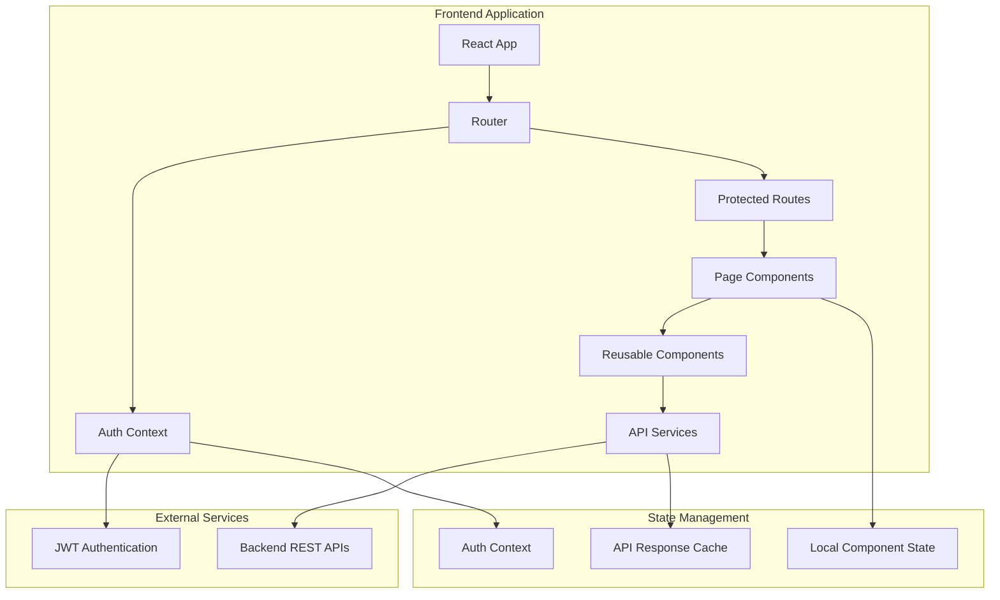

# Design Document

## Overview

The Parking Admin Dashboard is a React 19-based web application that provides a comprehensive interface for parking lot management. The application implements a modern, responsive design using TailwindCSS 4.x with role-based access control for Super Admins and Admins. The frontend integrates with existing REST APIs to provide real-time dashboard metrics, session management, payment collection, and administrative functions.

The application follows a component-based architecture with centralized state management, protected routing, and responsive design principles. It supports two primary user roles with distinct capabilities and access levels, ensuring secure and efficient parking operations management.

## Architecture

### High-Level Architecture



### Technology Stack

- **Frontend Framework**: React 19 with Vite
- **Styling**: TailwindCSS 4.x
- **Charts**: Recharts
- **Routing**: React Router DOM v6+
- **State Management**: React Context API
- **HTTP Client**: Axios
- **Authentication**: JWT tokens
- **Build Tool**: Vite
- **Package Manager**: npm/yarn

### Folder Structure

```
src/
├── assets/              # Static assets (logos, icons, images)
├── components/          # Reusable UI components
│   ├── common/         # Generic components (Button, Card, Modal)
│   ├── forms/          # Form components (Input, Select, Checkbox)
│   ├── layout/         # Layout components (Sidebar, Header, Footer)
│   └── charts/         # Chart components (KPICard, RevenueChart)
├── pages/              # Route-specific page components
│   ├── Login.jsx
│   ├── Dashboard.jsx
│   ├── AdminManagement.jsx
│   ├── LiveSessions.jsx
│   ├── PaymentCollection.jsx
│   ├── DailyClosure.jsx
│   └── Settings.jsx
├── layouts/            # Layout wrapper components
│   ├── AdminLayout.jsx
│   └── PublicLayout.jsx
├── services/           # API service functions
│   ├── api.js          # Axios configuration
│   ├── authService.js  # Authentication APIs
│   ├── adminService.js # Admin management APIs
│   └── sessionService.js # Session management APIs
├── context/            # React Context providers
│   ├── AuthContext.jsx
│   └── ThemeContext.jsx
├── hooks/              # Custom React hooks
│   ├── useAuth.js
│   ├── useApi.js
│   └── useLocalStorage.js
├── utils/              # Utility functions
│   ├── constants.js
│   ├── helpers.js
│   └── validators.js
├── guards/             # Route protection components
│   ├── ProtectedRoute.jsx
│   └── RoleBasedRoute.jsx
├── App.jsx             # Root application component
├── main.jsx            # Application entry point
└── routes.jsx          # Route definitions
```

## Components and Interfaces

### Core Components

#### 1. Authentication Components

**LoginPage Component**

```jsx
interface LoginPageProps {
  onLogin: (credentials: LoginCredentials) => Promise<void>;
  loading: boolean;
  error: string | null;
}

interface LoginCredentials {
  user_email: string;
  user_password: string;
  role: "admin" | "super_admin";
}
```

**AuthContext Provider**

```jsx
interface AuthContextType {
  user: User | null;
  token: string | null;
  login: (credentials: LoginCredentials) => Promise<void>;
  logout: () => void;
  isAuthenticated: boolean;
  isLoading: boolean;
}

interface User {
  user_id: number;
  username: string;
  user_email: string;
  role: "admin" | "super_admin";
  user_phone_no: string;
  user_address: string;
}
```

#### 2. Layout Components

**AdminLayout Component**

```jsx
interface AdminLayoutProps {
  children: React.ReactNode;
  user: User;
  onLogout: () => void;
}
```

**Sidebar Component**

```jsx
interface SidebarProps {
  user: User;
  currentPath: string;
  onNavigate: (path: string) => void;
  onLogout: () => void;
}

interface NavigationItem {
  id: string;
  label: string;
  path: string;
  icon: React.ComponentType;
  roles: string[];
  section: "MAIN" | "ADMINISTRATION" | "OPERATIONS" | "ACCOUNT";
}
```

#### 3. Dashboard Components

**KPICard Component**

```jsx
interface KPICardProps {
  title: string;
  value: string | number;
  subtitle: string;
  trend?: {
    value: string,
    direction: "up" | "down",
    color: "green" | "red",
  };
  loading?: boolean;
  error?: string;
}
```

**RevenueChart Component**

```jsx
interface RevenueChartProps {
  data: ChartDataPoint[];
  chartType: "area" | "bar";
  onChartTypeChange: (type: "area" | "bar") => void;
  loading?: boolean;
  error?: string;
}

interface ChartDataPoint {
  month: string;
  revenue: number;
  date: string;
}
```

#### 4. Data Management Components

**DataTable Component**

```jsx
interface DataTableProps<T> {
  columns: TableColumn<T>[];
  data: T[];
  loading?: boolean;
  error?: string;
  pagination?: PaginationConfig;
  onRowAction?: (action: string, row: T) => void;
}

interface TableColumn<T> {
  key: keyof T;
  label: string;
  render?: (value: any, row: T) => React.ReactNode;
  sortable?: boolean;
  width?: string;
}
```

### API Service Interfaces

#### Authentication Service

```javascript
// AuthService class with login, logout, and token management
class AuthService {
  async login(credentials) {
    // credentials: { user_email, user_password, role }
    // Returns: { access_token, role, user_id, username, user_email, user_phone_no, user_address }
  }

  logout() {
    // Clear authentication data
  }

  async refreshToken() {
    // Returns: new access token string
  }

  getCurrentUser() {
    // Returns: user object or null
  }
}

// Login response structure
const loginResponse = {
  access_token: "",
  role: "",
  user_id: 0,
  username: "",
  user_email: "",
  user_phone_no: "",
  user_address: "",
};
```

#### Admin Management Service

```javascript
// AdminService class for admin management operations
class AdminService {
  async createAdmin(adminData) {
    // adminData: { name, email, password, role: 'admin', assigned_lots }
    // Returns: creation response
  }

  async getAllAdmins() {
    // Returns: array of admin objects
  }

  async deleteAdmin(userId) {
    // userId: number
    // Returns: void
  }

  async getAllSessionDetails() {
    // Returns: array of session details
  }
}

// Create admin request structure
const createAdminRequest = {
  name: "",
  email: "",
  password: "",
  role: "admin", // Hardcoded as 'admin' in frontend - not user input
  assigned_lots: [],
};
```

#### Session Management Service

```javascript
// SessionService class for session operations
class SessionService {
  async getSessionDetails(userId) {
    // userId: number
    // Returns: array of session details
  }

  async checkInVehicle(checkInData) {
    // checkInData: check-in request object
    // Returns: void
  }

  async checkOutVehicle(vehicleRegNo) {
    // vehicleRegNo: string
    // Returns: void
  }

  async getDailyClosure() {
    // Returns: closure data object
  }

  async finalizeClosure(paymentData) {
    // paymentData: closure request object
    // Returns: closure response
  }
}

// Session detail structure
const sessionDetail = {
  ticket_id: "",
  parkinglot_id: 0,
  vehicle_reg_no: "",
  user_id: 0,
  start_time: "",
  end_time: null, // or string
  duration_hrs: null, // or number
  vehicle_type: "",
};
```

## Data Models

### User Data Model

```javascript
// User object structure
const user = {
  user_id: 0,
  username: "",
  user_email: "",
  role: "admin", // or 'super_admin'
  user_phone_no: "",
  user_address: "",
  assigned_lots: [], // Only for admin role
};
```

### Session Data Model

```javascript
// Parking session object structure
const parkingSession = {
  ticket_id: "",
  parkinglot_id: 0,
  vehicle_reg_no: "",
  user_id: 0,
  start_time: new Date(),
  end_time: null, // or Date object
  duration_hrs: null, // or number
  vehicle_type: "car", // or 'motorcycle'
  status: "active", // or 'completed'
};
```

### Payment Data Model

```javascript
// Payment object structure
const payment = {
  payment_id: "",
  vehicle_reg_no: "",
  amount: 0,
  date: new Date(),
  duration: "",
  status: "completed", // or 'pending' or 'failed'
  session_id: "",
};
```

### KPI Data Model

```javascript
// Dashboard KPIs object structure
const dashboardKPIs = {
  totalIncome: {
    value: 0,
    trend: 0,
    period: "",
  },
  totalSessions: {
    value: 0,
    trend: 0,
    period: "",
  },
  revenuePerSlot: {
    value: 0,
    trend: 0,
  },
  activeParticipants: {
    value: 0,
    trend: 0,
  },
  averageSessionTime: {
    value: "",
    trend: "",
  },
  occupancyRate: {
    value: 0,
    trend: 0,
  },
};

// Admin Management KPIs object structure
const adminManagementKPIs = {
  totalAdmins: {
    value: 0,
    label: "Total Admins"
  },
  superAdmins: {
    value: 0,
    label: "Super Admins"
  },
  regularAdmins: {
    value: 0,
    label: "Regular Admins"
  },
  totalLots: {
    value: 0,
    label: "Total Lots"
  }
};

// Live Sessions KPIs object structure
const liveSessionsKPIs = {
  activeParticipants: {
    value: 0,
    trend: "",
    label: "ACTIVE PARTICIPANTS"
  },
  totalRevenue: {
    value: 0,
    trend: "",
    label: "TOTAL REVENUE"
  },
  avgSessionTime: {
    value: "",
    trend: "",
    label: "AVG. SESSION TIME"
  },
  occupancyRate: {
    value: 0,
    trend: "",
    label: "OCCUPANCY RATE"
  }
};

// Payment Collection KPIs object structure
const paymentCollectionKPIs = {
  totalPayments: {
    value: 0,
    label: "Total Payments",
    iconColor: "blue"
  },
  completedPayments: {
    value: 0,
    label: "Completed",
    iconColor: "green"
  },
  pendingPayments: {
    value: 0,
    label: "Pending",
    iconColor: "orange"
  },
  failedPayments: {
    value: 0,
    label: "Failed",
    iconColor: "red"
  }
};

// Daily Closure KPIs object structure
const dailyClosureKPIs = {
  outstandingAmount: {
    value: 0,
    label: "Outstanding Amount",
    currency: "₹"
  },
  todayCollection: {
    value: 0,
    label: "Today's Collection",
    currency: "₹"
  },
  totalDue: {
    value: 0,
    label: "Total Due",
    currency: "₹"
  },
  amountPaid: {
    value: 0,
    label: "Amount Paid",
    currency: "₹"
  },
  newOutstanding: {
    value: 0,
    label: "New Outstanding",
    currency: "₹"
  }
};

// KPI calculation data structure
const kpiCalculationData = {
  sessions: [],
  totalParkingSlots: 0,
  previousPeriodSessions: [], // optional
};
```

### KPI Calculation Logic

#### 1. Total Income Calculation

```javascript
function calculateTotalIncome(sessions) {
  return sessions
    .filter((session) => session.end_time !== null) // Only completed sessions
    .reduce((total, session) => {
      // Calculate payment based on duration and vehicle type
      const duration = session.duration_hrs || 0;
      const baseRate = session.vehicle_type === "car" ? 50 : 30; // Example rates
      return total + duration * baseRate;
    }, 0);
}
```

#### 2. Total Sessions Calculation

```javascript
function calculateTotalSessions(sessions) {
  return sessions.length; // Count all sessions (active + completed)
}
```

#### 3. Revenue per Slot Calculation

```javascript
function calculateRevenuePerSlot(totalIncome, totalParkingSlots) {
  return totalParkingSlots > 0 ? totalIncome / totalParkingSlots : 0;
}
```

#### 4. Active Participants Calculation

```javascript
function calculateActiveParticipants(sessions) {
  return sessions.filter((session) => session.end_time === null).length;
}
```

#### 5. Average Session Time Calculation

```javascript
function calculateAverageSessionTime(sessions) {
  const completedSessions = sessions.filter(
    (session) => session.end_time !== null && session.duration_hrs !== null
  );

  if (completedSessions.length === 0) return "0h 0m";

  const totalHours = completedSessions.reduce(
    (sum, session) => sum + (session.duration_hrs || 0),
    0
  );

  const averageHours = totalHours / completedSessions.length;
  const hours = Math.floor(averageHours);
  const minutes = Math.round((averageHours - hours) * 60);

  return `${hours}h ${minutes}m`;
}
```

#### 6. Occupancy Rate Calculation

```javascript
function calculateOccupancyRate(activeParticipants, totalParkingSlots) {
  return totalParkingSlots > 0
    ? Math.round((activeParticipants / totalParkingSlots) * 100)
    : 0;
}
```

#### 7. Trend Calculation

```javascript
function calculateTrend(currentValue, previousValue) {
  if (previousValue === 0) return currentValue > 0 ? 100 : 0;
  return Math.round(((currentValue - previousValue) / previousValue) * 100);
}

function calculateTimeTrend(currentTime, previousTime) {
  const parseTime = (timeStr) => {
    const [hours, minutes] = timeStr
      .replace(/[hm]/g, "")
      .split(" ")
      .map(Number);
    return hours + minutes / 60;
  };

  const currentHours = parseTime(currentTime);
  const previousHours = parseTime(previousTime);
  const trendPercent = calculateTrend(currentHours, previousHours);

  return `${trendPercent > 0 ? "+" : ""}${trendPercent}%`;
}
```

### Daily Closure Data Model

```javascript
// Daily closure data structure
const closureData = {
  date: "",
  outstanding_amount: 0,
  today_collection: 0,
  total_due: 0,
  amount_paid: 0, // optional
  new_outstanding: 0, // optional
  status: "pending", // or 'completed'
};
```

## Page-Specific KPI Specifications

### Dashboard Page KPIs
The main dashboard displays comprehensive parking operation metrics arranged in two rows:

**Row 1 KPIs:**
- **Total Income**: Displays total revenue with currency formatting and percentage trend
- **Total Sessions**: Shows count of all completed bookings with trend indicator
- **Revenue per Slot**: Average revenue per parking slot with trend
- **Active Participants**: Current count of parked vehicles with trend

**Row 2 KPIs:**
- **Average Session Time**: Time format (e.g., "2h 45m") with time-based trend
- **Occupancy Rate**: Percentage utilization with trend indicator
- **Total Revenue**: Overall revenue across all parking lots with trend

### Admin Management Page KPIs (Super Admin Only)
Four horizontal cards displaying administrative statistics:

- **Total Admins Card**: Count of all admin accounts in the system
- **Super Admins Card**: Count of users with super admin privileges
- **Regular Admins Card**: Count of users with regular admin privileges  
- **Total Lots Card**: Total number of parking lots in the system

### Live Sessions Page KPIs
Four cards showing real-time session metrics:

- **Active Participants Card**: Current active sessions with hourly trend (e.g., "+3 from last hour")
- **Total Revenue Card**: Current session revenue with percentage trend
- **Avg. Session Time Card**: Average duration with time-based trend (e.g., "-5 min")
- **Occupancy Rate Card**: Current occupancy percentage with trend indicator

### Payment Collection Page KPIs
Four cards with color-coded icons showing payment statistics:

- **Total Payments Card**: Total count with blue square icon
- **Completed Payments Card**: Completed count with green square icon
- **Pending Payments Card**: Pending count with orange square icon
- **Failed Payments Card**: Failed count with red square icon

### Daily Closure Page KPIs
Five financial metric cards arranged in specific layout:

**Top Row (3 cards):**
- **Outstanding Amount Card**: Previous outstanding balance in ₹
- **Today's Collection Card**: Current day's collection in ₹
- **Total Due Card**: Combined outstanding and today's collection in ₹

**Bottom Row (2 cards, centered):**
- **Amount Paid Card**: Amount being settled in ₹
- **New Outstanding Card**: Remaining balance after settlement in ₹

**Additional Elements:**
- Status indicator showing "Pending Closure" with light brown/gold background
- "Finalize Closure" action button with purple background

### KPI Calculation Requirements

#### Admin Management KPIs
```javascript
function calculateAdminKPIs(adminData) {
  const totalAdmins = adminData.length;
  const superAdmins = adminData.filter(admin => admin.role === 'super_admin').length;
  const regularAdmins = adminData.filter(admin => admin.role === 'admin').length;
  const totalLots = getTotalParkingLots(); // From parking lot data
  
  return {
    totalAdmins,
    superAdmins,
    regularAdmins,
    totalLots
  };
}
```

#### Live Sessions KPIs
```javascript
function calculateLiveSessionKPIs(sessions, previousHourSessions) {
  const activeParticipants = sessions.filter(s => s.end_time === null).length;
  const previousActiveParticipants = previousHourSessions.filter(s => s.end_time === null).length;
  const hourlyTrend = activeParticipants - previousActiveParticipants;
  
  const currentRevenue = calculateSessionRevenue(sessions.filter(s => s.end_time === null));
  const avgSessionTime = calculateAverageSessionTime(sessions);
  const occupancyRate = calculateOccupancyRate(activeParticipants, totalParkingSlots);
  
  return {
    activeParticipants: {
      value: activeParticipants,
      trend: `${hourlyTrend > 0 ? '+' : ''}${hourlyTrend} from last hour`
    },
    totalRevenue: {
      value: currentRevenue,
      trend: calculateRevenueTrend(currentRevenue, previousRevenue)
    },
    avgSessionTime: {
      value: avgSessionTime,
      trend: calculateTimeTrend(avgSessionTime, previousAvgTime)
    },
    occupancyRate: {
      value: occupancyRate,
      trend: calculateTrend(occupancyRate, previousOccupancyRate)
    }
  };
}
```

#### Payment Collection KPIs
```javascript
function calculatePaymentKPIs(sessions) {
  const completedSessions = sessions.filter(s => s.end_time !== null);
  const activeSessions = sessions.filter(s => s.end_time === null);
  
  // Payment status is derived from session completion status
  const totalPayments = sessions.length;
  const completedPayments = completedSessions.length;
  const pendingPayments = activeSessions.length;
  const failedPayments = 0; // Calculate based on failed payment attempts
  
  return {
    totalPayments,
    completedPayments,
    pendingPayments,
    failedPayments
  };
}
```

#### Daily Closure KPIs
```javascript
function calculateClosureKPIs(closureData) {
  const {
    outstanding_amount,
    today_collection,
    payment_made = 0
  } = closureData;
  
  const totalDue = outstanding_amount + today_collection;
  const newOutstanding = totalDue - payment_made;
  
  return {
    outstandingAmount: outstanding_amount,
    todayCollection: today_collection,
    totalDue: totalDue,
    amountPaid: payment_made,
    newOutstanding: Math.max(0, newOutstanding)
  };
}
```

## Error Handling

### Error Types and Handling Strategy

#### 1. Authentication Errors

- **401 Unauthorized**: Token expired or invalid - redirect to login
- **403 Forbidden**: Insufficient permissions - show access denied message
- **Implementation**: Axios interceptors for global error handling

#### 2. API Errors

- **400 Bad Request**: Validation errors - show field-specific messages
- **404 Not Found**: Resource not found - show appropriate fallback UI
- **500 Server Error**: Server issues - show generic error message with retry option
- **Network Errors**: Connection issues - show offline indicator

#### 3. Form Validation Errors

- **Client-side validation**: Real-time validation with immediate feedback
- **Server-side validation**: Display API validation errors inline
- **Implementation**: Custom validation hooks with error state management

#### 4. Loading and Error States

```javascript
// Async state structure for components
const asyncState = {
  data: null,
  loading: false,
  error: null,
};

// Usage in components
const [sessionState, setSessionState] = useState({
  data: null,
  loading: false,
  error: null,
});
```

### Error Boundary Implementation

```jsx
// Error boundary state structure
const errorBoundaryState = {
  hasError: false,
  error: null,
};

class ErrorBoundary extends React.Component {
  constructor(props) {
    super(props);
    this.state = { hasError: false, error: null };
  }

  // Error boundary implementation for catching React errors
  static getDerivedStateFromError(error) {
    return { hasError: true, error };
  }

  componentDidCatch(error, errorInfo) {
    console.error("Error caught by boundary:", error, errorInfo);
  }

  render() {
    if (this.state.hasError) {
      return <div>Something went wrong.</div>;
    }
    return this.props.children;
  }
}
```

## Testing Strategy

### Unit Testing

- **Components**: Test rendering, props handling, user interactions
- **Services**: Test API calls, error handling, data transformation
- **Utilities**: Test helper functions, validators, formatters
- **Hooks**: Test custom hooks with React Testing Library

### Integration Testing

- **Authentication Flow**: Login, logout, token refresh
- **Route Protection**: Protected routes, role-based access
- **API Integration**: Service layer integration with mock APIs
- **Form Submission**: End-to-end form workflows

### E2E Testing

- **User Journeys**: Complete workflows for both user roles
- **Cross-browser Testing**: Ensure compatibility across browsers
- **Responsive Testing**: Test on different screen sizes
- **Accessibility Testing**: Keyboard navigation, screen readers

### Testing Tools

- **Unit/Integration**: Jest, React Testing Library
- **E2E**: Cypress or Playwright
- **Accessibility**: axe-core, WAVE
- **Performance**: Lighthouse, Web Vitals

## Security Considerations

### Authentication Security

- **JWT Storage**: Secure storage in httpOnly cookies or secure localStorage
- **Token Refresh**: Automatic token refresh before expiration
- **Logout Security**: Clear all authentication data on logout
- **Session Timeout**: Automatic logout after inactivity

### API Security

- **Authorization Headers**: Include JWT in all protected API calls
- **Request Validation**: Client-side validation before API calls
- **Error Handling**: Don't expose sensitive information in error messages
- **HTTPS Only**: Ensure all API calls use HTTPS

### Input Security

- **XSS Prevention**: Sanitize user inputs, use React's built-in protection
- **CSRF Protection**: Implement CSRF tokens for state-changing operations
- **Input Validation**: Validate all user inputs on client and server
- **SQL Injection**: Use parameterized queries (backend responsibility)

### Role-Based Security

- **UI Security**: Hide/disable features based on user role
- **Route Security**: Protect routes with role-based guards
- **API Security**: Backend validates user permissions for all operations
- **Data Filtering**: Show only data user is authorized to see

## Performance Optimization

### Code Splitting

- **Route-based Splitting**: Lazy load page components
- **Component Splitting**: Split large components into smaller chunks
- **Library Splitting**: Separate vendor bundles from application code

### Caching Strategy

- **API Response Caching**: Cache frequently accessed data
- **Image Optimization**: Optimize and cache static assets
- **Browser Caching**: Leverage browser caching for static resources

### Rendering Optimization

- **React.memo**: Memoize components to prevent unnecessary re-renders
- **useMemo/useCallback**: Memoize expensive calculations and functions
- **Virtual Scrolling**: For large data tables and lists
- **Debouncing**: For search inputs and API calls

### Bundle Optimization

- **Tree Shaking**: Remove unused code from bundles
- **Minification**: Minify JavaScript and CSS
- **Compression**: Enable gzip/brotli compression
- **Asset Optimization**: Optimize images, fonts, and other assets

This design provides a comprehensive foundation for building a scalable, maintainable, and secure parking admin dashboard that meets all the specified requirements while following modern React development best practices.
