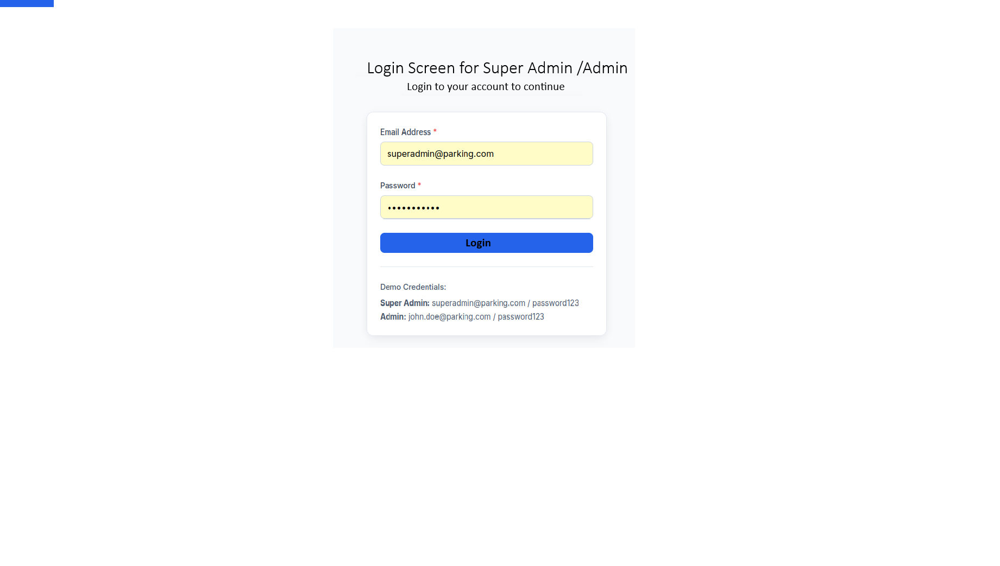
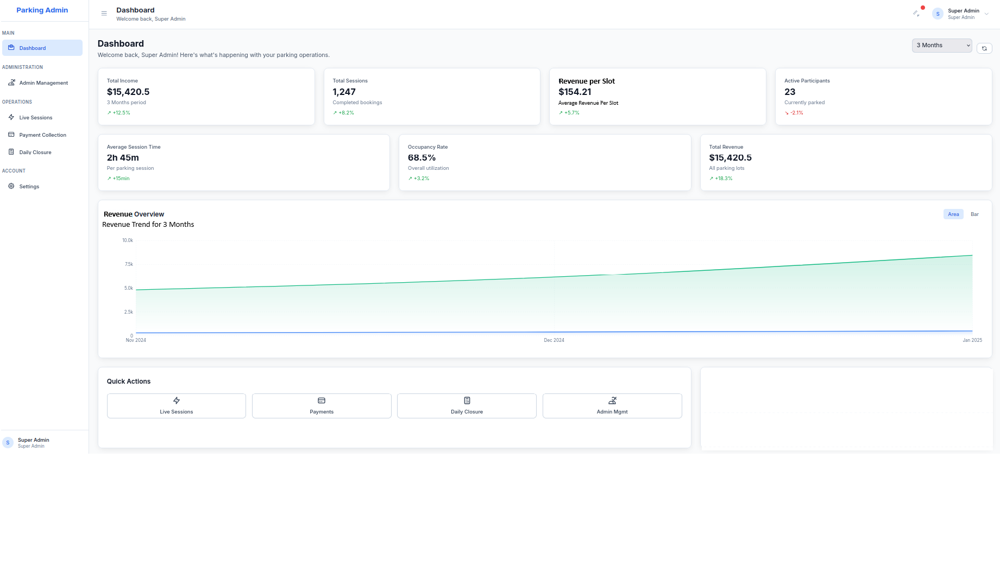
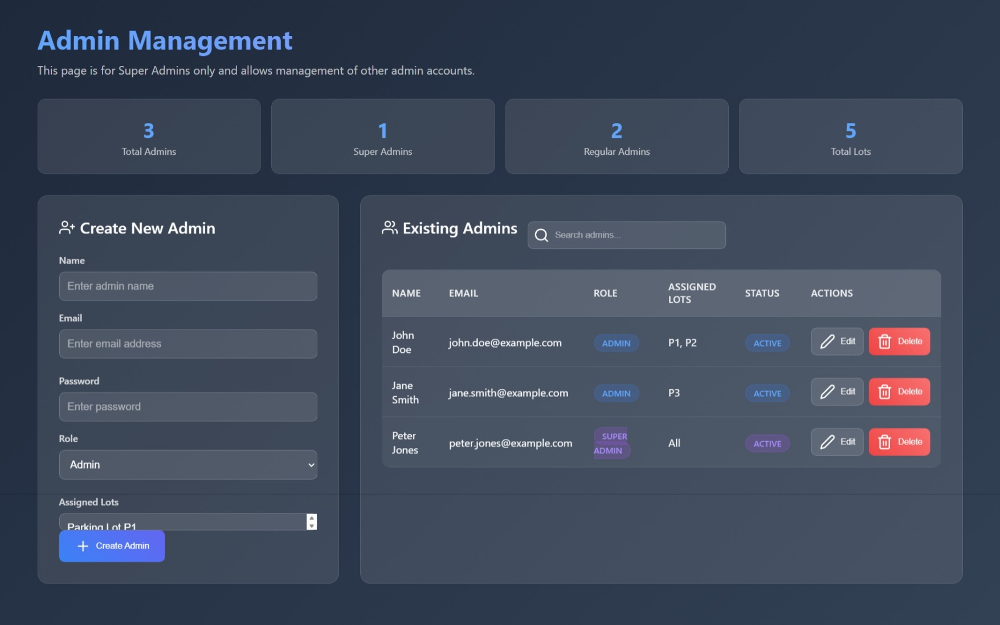
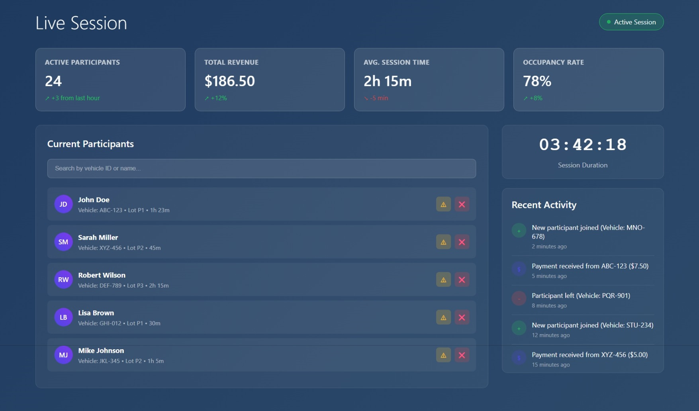
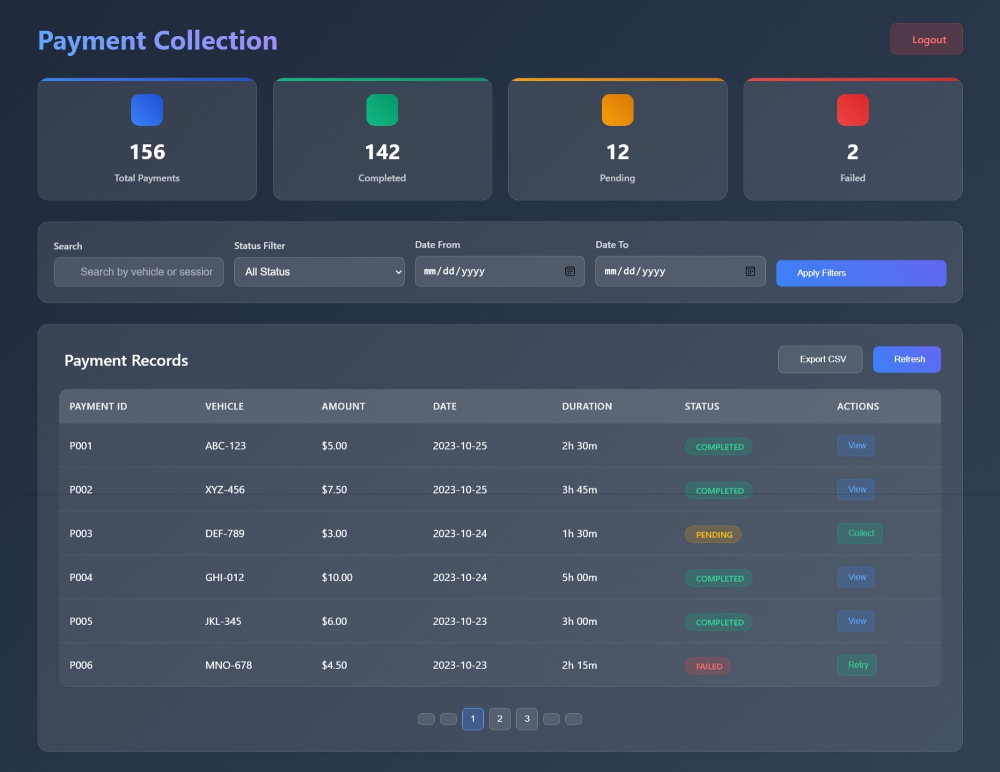
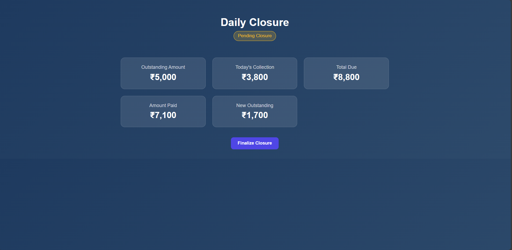
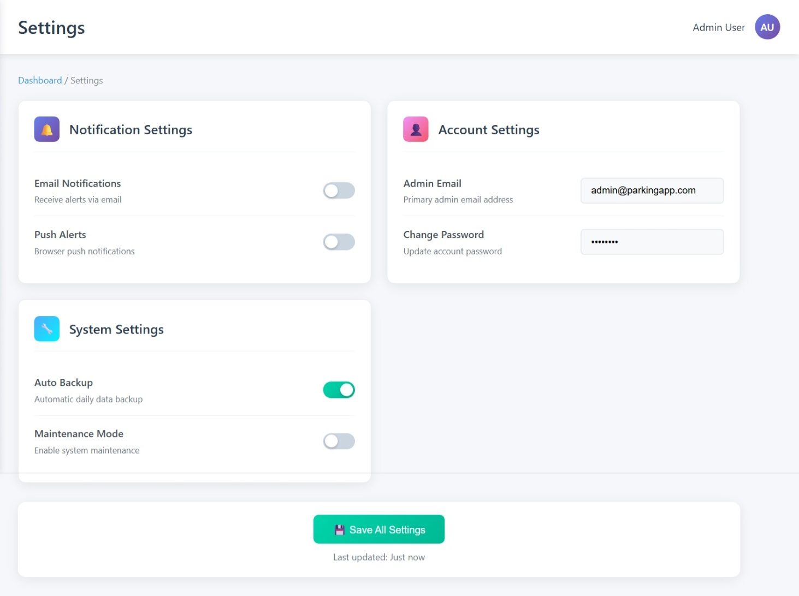

# 📋 Parking Admin Dashboard - Product Requirements Document (PRD)

## 🚀 Overview

The **Parking Admin Dashboard** is a modern, responsive frontend-only web application designed for efficient parking lot management. It allows **Super Admins** and **Admins** to view, track, and analyze parking sessions, revenue, and lot operations. This version focuses entirely on the **frontend**, while the backend is already implemented and exposed via REST APIs.

---

## 🎯 Scope

**This project includes only the frontend**, developed using **React 19**, **TailwindCSS 4.x**, and **Recharts**, and will integrate with an existing backend via REST APIs.

---

## 👤 User Roles

### 1. **Super Admin**

- Access to all dashboards, reports, and admin management.
- Can create or remove Sub Admin accounts.
- Can view and manage all parking lots.
- Can assign or remove parking lots to/from admins.

### 2. **Admin**

- Limited to their assigned parking lots.
- Can view real-time stats, sessions, and revenue for their lots.
- Can check-in/check-out vehicles, submit daily closure, and view closure history for their assigned lots.

---

## 🔐 Authentication & Authorization

- **Login**: Dedicated login page for username/password. On success, stores JWT and user info (including role) in global state (React Context or Redux).
- **Logout**:
  - **Confirmation Dialog**: Displays "Do you want to Sign Out this admin account?" message when logout option is clicked
  - **Action Buttons**: Provides "Yes" and "No" options for user confirmation
  - **Functionality**: Clears auth state and redirects to login only after user confirms
  - **Implementation**: Modal or confirmation dialog component with clear messaging
- **JWT Handling**: JWT is attached to all protected API calls via Authorization header. Logout clears the token.
- **Auth Context**: Provides user, token, login(), and logout() globally.
- **Protected Routing**: Uses a `<ProtectedRoute />` wrapper to guard all authenticated routes. Redirects unauthenticated users to login.
- **Role-Based Routing**: Uses a `<RolesAuthRoute roles={['super_admin']}>` or `<RolesAuthRoute roles={['admin']}>` to restrict access to certain routes/components based on user role. Unauthorized access redirects to login or a Not Authorized page.
- **Role-Based UI**: UI elements (buttons, links, pages) are shown/hidden based on user role.

---

---

## Page Layout & Navigation (Tailwind Conventions)

The dashboard uses a modern, responsive layout built with Tailwind CSS, as illustrated in the new design image. The structure is as follows:

- **Flex Layout (Sidebar + Content):**

  - The app is wrapped in a flex container spanning the full height of the screen:
    ```jsx
    <div class="flex h-screen bg-gray-100">
      {/* Sidebar */}
      <div class="hidden md:flex md:w-64 md:flex-col bg-white border-r">
        {/* Logo/header, then nav */}
      </div>
      {/* Main Content */}
      <div class="flex-1 flex flex-col">
        {/* Top Navbar */}
        <header class="w-full bg-white shadow px-4 py-2 flex items-center justify-between">
          {/* Page title, welcome message, user avatar, time period dropdown */}
        </header>
        {/* Page Content */}
        <main class="flex-1 overflow-auto p-4 space-y-4">
          {/* Summary cards, chart, quick actions */}
        </main>
      </div>
    </div>
    ```
  - The sidebar is fixed on wide screens (using `md:flex`), and the content area scrolls independently.
  - The overall background uses `bg-gray-100` for a clean, modern look.

- **Sidebar (Vertical Navigation):**

  - Grouped into sections: MAIN, ADMINISTRATION, OPERATIONS, ACCOUNT.
  - Each navigation item has a clear icon and label (e.g., dashboard, admin, sessions, payments, closure, settings).
  - Active item is highlighted with a blue background and bold text.
  - User info (Super Admin) is shown at the bottom left, with avatar and role.
  - Clean, minimal branding area at the top with app name/logo.
  - Responsive design: sidebar collapses to a hamburger menu on small screens.

- **Top Navigation (Header):**

  - Large, bold "Dashboard" heading in the main content area.
  - Welcome message: "Welcome back, Super Admin! Here's what's happening with your parking operations."
  - Top-right navigation bar includes:
    - Time period dropdown labeled "3 Months" (default, can be changed)
    - User profile icon/avatar with user role (Super Admin)
  - Clean, minimal header design with clear hierarchy.

- **Summary Cards & Main Content:**

  - Summary cards are arranged in two rows, each card in a white, slightly raised container with rounded corners and subtle shadow.
  - Each card displays:
    - Main value (large, bold)
    - Sub-label (smaller, lighter text)
    - Trend indicator (arrow and percentage, color-coded: green for up, red for down)
  - Cards are spaced evenly and wrap to new lines on smaller screens.
  - Below the summary cards is the Revenue Overview section:
    - Section title ("Revenue Overview") and subtitle ("Revenue Trend for 3 Months")
    - Area/Bar chart toggle (default: Area)
    - Chart with X-axis (months) and Y-axis (revenue)
    - Chart area is filled with a light green gradient for positive trends.
  - Below the chart is the Quick Actions section:
    - Row of four large, outlined buttons (Live Sessions, Payments, Daily Closure, Admin Mgmt), each with an icon and label.
    - Buttons are evenly spaced and responsive.

- **Design Elements:**

  - Uses Tailwind classes like `flex flex-col flex-grow pt-5 overflow-y-auto` for scrollability.
  - Navigation links use classes such as `px-2 py-2 text-sm font-medium rounded-md` for styling, with active highlights for the current page.
  - Cards, buttons, and chart containers use consistent spacing, padding, and font sizes for clarity and accessibility.
  - Modern, clean typography and subtle shadows for raised appearance.

- **Responsive Design:**
  - Layout adapts for tablets and mobile:
    - Sidebar collapses to a hamburger menu.
    - Summary cards and quick actions stack vertically on small screens.
    - Chart and content area remain scrollable.
  - Uses Tailwind responsive breakpoints (`sm:`, `md:`, `lg:`) to adjust layout.

## 📊 Guidelines for KPI Data in Summary Cards

- All KPI card values shown below are **examples** or **placeholders**. Real values will be fetched from backend APIs.

- Each KPI group includes a **KPI Data Contract** specifying expected fields, types, units, API endpoints, update frequency, and fallback states.

- **Edge cases, loading, and error states** are documented for each KPI group.

- **Page Layouts:**

  -**Login (for Super Admin and Admin):**

  

  - **Centered Login Card:**

    - White card with subtle shadow, centered on the page.
    - Title: "Login Screen for Super Admin / Admin" (large, bold, centered).
    - Subtitle: "Login to your account to continue" (smaller, centered).

  - **Form Fields:**

    - **Email Address** (required, labeled, with placeholder and sample value: `superadmin@parking.com`).
    - **Password** (required, labeled, with placeholder and masked input).
    - Both fields have a light yellow background when filled.

  - **Login Button:**

    - Large, blue, full-width button labeled "Login".

  - **Demo Credentials Section:**

    - Below the button, a divider and a "Demo Credentials:" label.
    - Lists:
      - **Super Admin:** `superadmin@parking.com / password123`
      - **Admin:** `john.doe@parking.com / password123`
    - Credentials are styled with bold labels for roles.

  - **Design Elements:**

    - Card is responsive and remains centered on all screen sizes.
    - Clean, modern typography and spacing.
    - No additional links or branding in this version.

  - **Dashboard:**

    > **Note:** The Dashboard page is the main landing page after login.

    

    - **Header Section:**

      - Large, bold "Dashboard" title at the top-left of the main content area
      - Welcome message: "Welcome back, Super Admin! Here's what's happening with your parking operations."
      - Top-right navigation bar containing:
        - Time period dropdown labeled "3 Months" (default, can be changed)
        - User profile icon/avatar with user role (Super Admin)

    - **Summary Cards (Key Performance Indicators - KPIs):**

      - _All KPI values below are **examples**. See Guidelines for KPI Data in Summary Cards for details on real data integration, contracts, and edge cases._
      - Cards are arranged in two rows, each card with a main value, sub-label, and trend indicator (color-coded with arrow):
        - **Row 1:**
          - **Total Income**
            - Value: "$15,420.5" _(example)_
            - Sub-label: "3 Months period"
            - Trend: "+12.5%" _(example, green up arrow)_
          - **Total Sessions**
            - Value: "1,247" _(example)_
            - Sub-label: "Completed bookings"
            - Trend: "+8.2%" _(example, green up arrow)_
          - **Revenue per Slot**
            - Value: "$154.21" _(example)_
            - Sub-label: "Average Revenue Per Slot"
            - Trend: "+5.7%" _(example, green up arrow)_
          - **Active Participants**
            - Value: "23" _(example)_
            - Sub-label: "Currently parked"
            - Trend: "-2.1%" _(example, red down arrow)_
        - **Row 2:**
          - **Average Session Time**
            - Value: "2h 45m" _(example)_
            - Sub-label: "Per parking session"
            - Trend: "-15min" _(example, red down arrow)_
          - **Occupancy Rate**
            - Value: "68.5%" _(example)_
            - Sub-label: "Overall utilization"
            - Trend: "+3.2%" _(example, green up arrow)_
          - **Total Revenue**
            - Value: "$15,420.5" _(example)_
            - Sub-label: "All parking lots"
            - Trend: "+18.3%" _(example, green up arrow)_

    - **Revenue Overview:**

      - Section title: "Revenue Overview"
      - Subtitle: "Revenue Trend for 3 Months"
      - Area/Bar chart toggle (default: Area)
      - X-axis: Months (e.g., Nov 2024, Dec 2024, Jan 2025)
      - Y-axis: Revenue (0 to 10k)
      - Chart shows a positive trend with a green area fill

    - **Quick Actions:**

      - Row of action buttons below the chart:
        - **Live Sessions** (lightning icon)
        - **Payments** (card icon)
        - **Daily Closure** (calendar/closure icon)
        - **Admin Mgmt** (admin icon)
      - Each button is rectangular, outlined, and has an icon and label

    - **Sidebar:**
      - Left sidebar with grouped navigation:
        - **MAIN**: Dashboard
        - **ADMINISTRATION**: Admin Management
        - **OPERATIONS**: Live Sessions, Payment Collection, Daily Closure
        - **ACCOUNT**: Settings
      - Each item has a relevant icon and active state highlight
      - User info (Super Admin) at the bottom left

  - **Admin Management:**

    

    - **Header Section:**

      - Large, blue "Admin Management" title prominently displayed
      - Grey subtitle: "This page is for Super Admins only and allows management of other admin accounts."

    - **Summary Cards (Key Performance Indicators - KPIs):**

      - Four rectangular cards with rounded corners arranged horizontally:
        - **Total Admins Card:** Displays "3" _(example)_ with "Total Admins" label
        - **Super Admins Card:** Displays "1" _(example)_ with "Super Admins" label
        - **Regular Admins Card:** Displays "2" _(example)_ with "Regular Admins" label
        - **Total Lots Card:** Displays "5" _(example)_ with "Total Lots" label

    - **Main Content Area:**

      - **Two-Panel Layout:**

        - **Left Panel - Create New Admin:**

          - Panel title: "Create New Admin" with person-plus icon
          - Form fields:
            - **Name Field:** Text input labeled "Name" with placeholder "Enter admin name"
            - **Email Field:** Text input labeled "Email" with placeholder "Enter email address"
            - **Password Field:** Text input labeled "Password" with placeholder "Enter password"
            - **Role Dropdown:** Dropdown labeled "Role" with "Admin" selected
            - **Assigned Lots Field:** Input showing "Parking Lot P1" with up/down arrows and plus icon for multiple lots
          - **Create Admin Button:** Blue, rounded button with plus icon and "+ Create Admin" text

        - **Right Panel - Existing Admins:**
          - Panel title: "Existing Admins" with people icon
          - **Search Bar:** Input field with magnifying glass icon and placeholder "Search admins..."
          - **Admin Table** with columns:
            - NAME
            - EMAIL
            - ROLE (displayed as colored pill-shaped tags)
            - ASSIGNED LOTS
            - STATUS (displayed as blue pill-shaped tags)
            - ACTIONS
          - **Table Rows Examples:**
            - **John Doe:** john.doe@example.com, ADMIN role (blue tag), P1, P2 lots, ACTIVE status, Edit/Delete actions
            - **Jane Smith:** jane.smith@example.com, ADMIN role (blue tag), P3 lot, ACTIVE status, Edit/Delete actions
            - **Peter Jones:** peter.jones@example.com, SUPER ADMIN role (purple tag), All lots, ACTIVE status, Edit/Delete actions
          - **Action Buttons:** Edit button with pencil icon, Delete button with trash can icon (red)

    - **Design Elements:**
      - Dark theme with dark blue/grey background
      - Rounded corners on all panels and cards
      - Blue for primary actions and active statuses
      - Red for delete actions
      - Purple highlighting for SUPER ADMIN role (distinct from regular ADMIN)
      - Consistent icon usage throughout the interface

  - **Live Session:**

    

    - **Header Section:**

      - Large, white "Live Session" title in top-left corner
      - Session status indicator in top-right: green circular icon with "Active Session" text

    - **Summary Cards (Key Performance Indicators - KPIs):**

      - Four rectangular cards with rounded corners arranged horizontally:
        - **Active Participants Card:**
          - Label: "ACTIVE PARTICIPANTS"
          - Value: "24" _(example)_
          - Trend: Green upward arrow with "+3 from last hour" _(example)_
        - **Total Revenue Card:**
          - Label: "TOTAL REVENUE"
          - Value: "$186.50" _(example)_
          - Trend: Green upward arrow with "+12%" _(example)_
        - **Avg. Session Time Card:**
          - Label: "AVG. SESSION TIME"
          - Value: "2h 15m" _(example)_
          - Trend: Red downward arrow with "-5 min" _(example)_
        - **Occupancy Rate Card:**
          - Label: "OCCUPANCY RATE"
          - Value: "78%" _(example)_
          - Trend: Green upward arrow with "+8%" _(example)_

    - **Main Content Area:**

      - **Two-Panel Layout:**

        - **Left Panel - Current Participants:**

          - Panel title: "Current Participants" in white text
          - **Search Bar:** Grey input field with placeholder "Search by vehicle ID or name..."
          - **Participant List:** Scrollable vertical list with individual entries:
            - **Avatar:** Circular purple avatar with white initials (JD, SM, RW, LB, MJ)
            - **Participant Name:** Full name in white text (John Doe, Sarah Miller, etc.)
            - **Vehicle Details:** Lighter grey text showing "Vehicle: ABC-123 • Lot P1 • 1h 23m"
            - **Action Buttons:** Two small square buttons on far right:
              - Yellow triangle with exclamation mark (alert/warning)
              - Red 'X' (close/remove action)
          - **Example Visible Participants:**
            - John Doe (Vehicle: ABC-123, Lot P1, 1h 23m)
            - Sarah Miller (Vehicle: XYZ-456, Lot P2, 45m)
            - Robert Wilson (Vehicle: DEF-789, Lot P3, 2h 15m)
            - Lisa Brown (Vehicle: GHI-012, Lot P1, 30m)
            - Mike Johnson (Vehicle: JKL-345, Lot P2, 1h 5m)

        - **Right Panel:**
          - **Session Duration Section:**
            - Large digital clock displaying "03:42:18" in white font
            - "Session Duration" label in lighter grey text below
          - **Recent Activity Section:**
            - Section title: "Recent Activity" in white text
            - **Activity List:** Vertical list of recent events with icons and timestamps:
              - Green plus icon: "New participant joined (Vehicle: MNO-678)" - "2 minutes ago"
              - Purple dollar icon: "Payment received from ABC-123 ($7.50)" - "5 minutes ago"
              - Red minus icon: "Participant left (Vehicle: PQR-901)" - "8 minutes ago"
              - Green plus icon: "New participant joined (Vehicle: STU-234)" - "12 minutes ago"
              - Purple dollar icon: "Payment received from XYZ-456 ($5.00)" - "15 minutes ago"

    - **Design Elements:**
      - Dark blue background theme
      - White and colored text for readability and emphasis
      - Clean, modern interface with contrasting elements
      - Color-coded trend indicators (green for positive, red for negative)
      - Consistent icon usage throughout the interface

  - **Payment Collection:**

    

    - **Header Section:**

      - Large, bold "Payment Collection" title in purple-blue gradient font in top-left corner
      - Red, rounded "Logout" button in top-right corner

    - **Summary Cards (Key Performance Indicators - KPIs):**

      - Four rectangular cards with rounded corners arranged horizontally:
        - **Total Payments Card:**
          - Blue square icon
          - Value: "156" _(example)_
          - Label: "Total Payments"
        - **Completed Payments Card:**
          - Green square icon
          - Value: "142" _(example)_
          - Label: "Completed"
        - **Pending Payments Card:**
          - Orange square icon
          - Value: "12" _(example)_
          - Label: "Pending"
        - **Failed Payments Card:**
          - Red square icon
          - Value: "2" _(example)_
          - Label: "Failed"

    - **Main Content Area:**

      - **Filter Section:**

        - **Search Input:** Text input labeled "Search" with placeholder "Search by vehicle or session"
        - **Status Filter:** Dropdown menu labeled "Status Filter" with "All Status" selected
        - **Date From:** Date input labeled "Date From" with placeholder "mm/dd/yyyy" and calendar icon
        - **Date To:** Date input labeled "Date To" with placeholder "mm/dd/yyyy" and calendar icon
        - **Apply Filters Button:** Blue, rounded button labeled "Apply Filters"

      - **Payment Records Section:**

        - **Section Title:** "Payment Records" heading above the table
        - **Action Buttons:**
          - "Export CSV" button (grey, rounded)
          - "Refresh" button (blue, rounded)
        - **Data Table** with columns:
          - PAYMENT ID (e.g., P001, P002)
          - VEHICLE (e.g., ABC-123, XYZ-456)
          - AMOUNT (e.g., $5.00, $7.50)
          - DATE (e.g., 2023-10-25)
          - DURATION (e.g., 2h 30m, 3h 45m)
          - STATUS (colored badges):
            - "COMPLETED" (green badge)
            - "PENDING" (orange badge)
            - "FAILED" (red badge)
          - ACTIONS (context-specific buttons):
            - "View" button (blue, for COMPLETED payments)
            - "Collect" button (green, for PENDING payments)
            - "Retry" button (green, for FAILED payments)
        - **Example Table Rows:**
          - P001, ABC-123, $5.00, 2023-10-25, 2h 30m, COMPLETED, View
          - P002, XYZ-456, $7.50, 2023-10-25, 3h 45m, COMPLETED, View
          - P003, DEF-789, $3.00, 2023-10-24, 1h 30m, PENDING, Collect
          - P004, GHI-012, $10.00, 2023-10-24, 5h 00m, COMPLETED, View
          - P005, JKL-345, $6.00, 2023-10-23, 3h 00m, COMPLETED, View
          - P006, MNO-678, $4.50, 2023-10-23, 2h 15m, FAILED, Retry

      - **Pagination:**
        - Page numbers "1", "2", "3" at bottom center
        - Page "1" highlighted with blue background
        - Navigation arrows for page navigation

    - **Design Elements:**
      - Dark theme with clean, modern color palette
      - Contrasting colors for status indicators and interactive elements
      - Rounded corners on all cards and buttons
      - Color-coded status badges and action buttons
      - Consistent spacing and typography throughout

  - **Daily Closure:**

    

    - **Header Section:**

      - Large, bold, white "Daily Closure" title centered horizontally near the top
      - **Status Indicator:** Horizontally elongated, rounded rectangular tag with light brown/gold background and dark text reading "Pending Closure", also centered

    - **Summary Cards (Key Performance Indicators - KPIs):**

      - Five rectangular cards with slightly rounded corners and lighter blue-grey background
      - Cards arranged in two rows: three cards in top row, two cards in bottom row (centered)
      - Each card contains a label at the top and monetary value below in larger, bold, white font with Indian Rupee symbol (₹)
      - **Card Layout:**
        - **Top Row (Left to Right):**
          - **Outstanding Amount Card:** Label "Outstanding Amount", Value "₹5,000" _(example)_
          - **Today's Collection Card:** Label "Today's Collection", Value "₹3,800" _(example)_
          - **Total Due Card:** Label "Total Due", Value "₹8,800" _(example)_
        - **Bottom Row (Left to Right):**
          - **Amount Paid Card:** Label "Amount Paid", Value "₹7,100" _(example)_
          - **New Outstanding Card:** Label "New Outstanding", Value "₹1,700" _(example)_

    - **Main Content Area:**

      - Centered layout with clear visual hierarchy
      - Prominent action button for finalizing daily closure

    - **Action Button:**

      - Centered horizontally below the financial metrics cards
      - Rectangular button with rounded corners
      - Solid purple background with white text
      - Button text: "Finalize Closure"

    - **Design Elements:**
      - Dark blue background theme
      - Subtle contrast between dark blue main background and lighter blue-grey card backgrounds
      - Clean, centered layout with clear visual hierarchy
      - Consistent typography and spacing throughout
      - Prominent action button for finalizing daily closure

  - **Settings:**

    

    - **Header Section:**

      - Large, bold, dark grey "Settings" title in top-left corner
      - Breadcrumb navigation: "Dashboard / Settings" in smaller, light blue font below the title
      - User information in top-right: "Admin User" in dark grey text with purple circular avatar containing white initials "AU"

    - **Main Content Area:**

      - Light grey background with three distinct white cards with rounded corners
      - Cards arranged in two rows: two cards in top row, one larger card in bottom row spanning the width

      - **Notification Settings Card (Top Left):**

        - **Header:** Purple bell icon with "Notification Settings" title in bold, dark grey text
        - **Content:**
          - **Email Notifications:** Bold text "Email Notifications" with "Receive alerts via email" in smaller, lighter grey text, grey toggle switch in "off" position
          - **Push Alerts:** Bold text "Push Alerts" with "Browser push notifications" in smaller, lighter grey text, grey toggle switch in "off" position

      - **Account Settings Card (Top Right):**

        - **Header:** Pink person icon with "Account Settings" title in bold, dark grey text
        - **Content:**
          - **Admin Email:** Bold text "Admin Email" with "Primary admin email address" in smaller, lighter grey text, white input field with light grey border containing "admin@parkingapp.com"
          - **Change Password:** Bold text "Change Password" with "Update account password" in smaller, lighter grey text, white input field with light grey border containing masked text "**\*\*\*\***"

      - **System Settings Card (Bottom, spanning width):**
        - **Header:** Light blue wrench icon with "System Settings" title in bold, dark grey text
        - **Content:**
          - **Auto Backup:** Bold text "Auto Backup" with "Automatic daily data backup" in smaller, lighter grey text, green toggle switch in "on" position
          - **Maintenance Mode:** Bold text "Maintenance Mode" with "Enable system maintenance" in smaller, lighter grey text, grey toggle switch in "off" position

    - **Action Button and Status:**

      - **Save All Settings Button:** Centered horizontally below the cards, rectangular button with rounded corners, teal-green background, white floppy disk icon, "Save All Settings" text in white, bold font
      - **Last Updated Text:** Below the button in smaller, light grey text: "Last updated: Just now"

    - **Design Elements:**
      - Clean, minimalist design with white and light grey color palette
      - Accent colors (purple, pink, light blue, green, teal) for icons and active toggle switches
      - Cards with subtle shadows for raised appearance
      - Clear, legible typography with bolding for titles and labels
      - Consistent spacing and visual hierarchy throughout

- **Responsive Design & Utilities:**

  - Tailwind utilities are used for spacing (`space-y-4`, `gap-4`), typography (`text-lg`, `font-bold`), and color (`bg-white`, `text-gray-700`).
  - The sidebar uses a fixed width (`md:w-64`), and the content area grows (`flex-1`).
  - Responsive breakpoints (`sm:`, `md:`, `lg:`) adjust the layout for tablets and mobiles.
  - On mobile, navigation is accessible via a hamburger menu and overlays the content.

- **Summary:**
  - The layout follows Tailwind's official sidebar/dashboard examples, using a flexbox shell with a left sidebar and top header.
  - All navigation and content areas are styled with Tailwind utility classes for consistency and maintainability.
  - The structure is designed to be easily extensible for future pages and features.

---

## 🔄 Routing Structure

### Public Routes

- **`/login`**: Public login page for authentication
  - **Access**: Unauthenticated users only
  - **Redirect**: Authenticated users redirected to `/dashboard`
  - **Features**: Username/password form, error handling, loading states

### Protected Routes (Authenticated Users)

- **`/dashboard`**: Main dashboard with KPIs and analytics

  - **Access**: All authenticated users (Super Admin & Admin)
  - **Features**: Income, Sessions, Revenue per space cards, Booking Overview chart
  - **Layout**: Default admin layout with sidebar navigation

- **`/live-sessions`**: Real-time session monitoring

  - **Access**: All authenticated users (Super Admin & Admin)
  - **Features**: Active participants, session duration, recent activity
  - **Layout**: Two-panel layout with participant list and activity feed

- **`/payment-collection`**: Payment records and management

  - **Access**: All authenticated users (Super Admin & Admin)
  - **Features**: Payment search, filtering, export, status management
  - **Layout**: Summary cards, filter section, data table with pagination

- **`/daily-closure`**: Daily financial closure management

  - **Access**: All authenticated users (Super Admin & Admin)
  - **Features**: Financial metrics, closure finalization
  - **Layout**: Centered layout with status indicator and action button

- **`/settings`**: User and system configuration
  - **Access**: All authenticated users (Super Admin & Admin)
  - **Features**: Notification settings, account settings, system settings
  - **Layout**: Card-based layout with form controls

### Super Admin Only Routes

- **`/admin-management`**: Admin account management

  - **Access**: Super Admin only
  - **Features**: Create new admin, manage existing admins, role assignment
  - **Layout**: Two-panel layout with form and data table
  - **Protection**: `<RolesAuthRoute roles={['super_admin']}>`

- **`/assign-lots`**: Parking lot assignment management
  - **Access**: Super Admin only
  - **Features**: Assign/remove parking lots to/from admins
  - **Layout**: Form-based layout with assignment controls
  - **Protection**: `<RolesAuthRoute roles={['super_admin']}>`

### Route Protection & Guards

- **`<ProtectedRoute />`**: Wraps all authenticated routes

  - **Function**: Checks for valid JWT token
  - **Redirect**: Unauthenticated users → `/login`
  - **Implementation**: Uses AuthContext for token validation

- **`<RolesAuthRoute roles={['super_admin']}>`**: Role-based access control
  - **Function**: Validates user role against required roles
  - **Redirect**: Unauthorized users → `/dashboard` or error page
  - **Implementation**: Checks user.role from AuthContext

### Navigation & Redirects

- **Default Route**: `/dashboard` (after successful login)
- **Fallback Route**: `/login` (for unauthenticated access)
- **Error Routes**:
  - **`/404`**: Page not found
  - **`/403`**: Access forbidden (role-based)
  - **`/500`**: Server error

### Route Configuration

- **Base Path**: `/` (root)
- **Hash Routing**: `#` (optional for deployment compatibility)
- **Lazy Loading**: Implemented for large route components
- **Route Parameters**: Dynamic routes for admin IDs, lot IDs, etc.
- **Query Parameters**: Used for filtering, pagination, search

### Implementation Details

- **Router**: React Router DOM v6+
- **Route Definitions**: Centralized in `src/routes.jsx`
- **Layout Wrappers**: `<AdminLayout>` for all authenticated routes
- **Loading States**: Suspense boundaries for route transitions
- **Error Boundaries**: Catch and handle route-level errors

---

## 🧩 UI Components & API Mapping

### Authentication

- **Login Page**: Calls `POST /auth/login`, stores JWT and user info, redirects to dashboard
- **Logout Button**:
  - **Confirmation Dialog**: Shows "Do you want to Sign Out this admin account?" message
  - **Action Buttons**: "Yes" (confirms logout) and "No" (cancels logout) options
  - **Functionality**: Clears auth state and redirects to login only after confirmation
  - **Implementation**: Modal dialog with clear messaging and action buttons
- **Auth Context**: Manages user/token globally
- **ProtectedRoute / RolesAuthRoute**: Guards all protected/role-based routes

### Super Admin Features

- **Admin Management Page**

  - **Create Admin Form**: `POST /admin/assign_lot` (create new admin with lot assignments)
    - **Request Body**: `{ "name": "Jane Smith", "email": "jane.smith@example.com", "password": "securePassword123", "assigned_lots": [1, 3] }`
    - **Response**: `{ "message": "Admin created successfully", "user_id": 42, "role": "admin", "assigned_lots": [1, 3] }`
    - **Usage**: When "Create Admin" button is pressed on admin management screen
  - **Admin List**: `GET /admins/admin_lots/all` (retrieve all admin lot assignments)
    - **Response**: List of admins with their assigned parking lot IDs
    - **Usage**: Populate "Existing Admins" section of admin management screen
  - **Delete Admin**: `DELETE /admin/remove_assignment` (remove admin-lot assignment)
    - **Usage**: When "Delete" button is pressed on admin management screen

- **Live Sessions Page (Super Admin)**

  - **All Sessions Data**: `GET /admin/sessions/details/all` (get all parking session details for last 3 months)
    - **Response**: Complete session table covering parking lots of all admins
    - **Usage**: Populate "Live Sessions" screen for super admin

- **Payment Collection Page (Super Admin)**
  - **All Sessions Data**: `GET /admin/sessions/details/all` (get all parking session details for last 3 months)
    - **Usage**: Populate "Payment Collections" screen for super admin

### Admin Features

- **Assigned Lots List**: `GET /admin_lots/<user_id>` (get all lot IDs assigned to current admin)

  - **Protected**: Yes (admin role)
  - **Usage**: Display assigned parking lots for the logged-in admin

- **Live Sessions Page (Admin)**

  - **Session Details**: `GET /admin/session/details/<user_id>` (get all parking session details for this admin)
    - **Request**: `{ "user_id": 123, "time in months": 3 }`
    - **Response**: Session details for the specific admin
    - **Usage**: Populate "Live Sessions" screen for admin

- **Check-In Form**: `POST /admin/session/checkin` (admin check-in for a vehicle)

  - **Request Body**: `{ "vehicle_reg_no": "DL01AB1234", "slot_id": 12, "lot_id": 3, "vehicle_type": "Car" }`
  - **Protected**: Yes (admin role)
  - **Usage**: Vehicle check-in functionality

- **Check-Out Form**: `POST /admin/session/checkout` (admin check-out for a vehicle)

  - **Request Body**: `{ "vehicle_reg_no": "DL01AB1234" }`
  - **Protected**: Yes (admin role)
  - **Usage**: Live session screen "X" button to checkout

- **Daily Closure Page**
  - **Total Due Data**: `GET /admin/closure` (retrieve outstanding and today's collection)
    - **Response**: `{ "date": "2025-07-04", "outstanding_amount": 5450.75, "today_collection": 3210.50 }`
    - **Usage**: Populate daily closure screen metrics
  - **Finalize Closure**: `POST /admin/closure` (admin submits settlement amount)
    - **Request Body**: `{ "payment_made": 7980 }`
    - **Response**: `{ "new_outstanding": 681.25 }`
    - **Usage**: When "Finalize Closure" button is pressed on daily closure screen
  - **Closure History**: `GET /admin/closure` (get closure ledger entries)
    - **Response**: `{ "opening_balance": 1000.0, "today_collection": 800.0, "payment_made": 500.0, "closing_balance": 1300.0 }`
    - **Usage**: Populate daily closure screen

### Shared Components

- **Sidebar**: Vertical navigation, role-based links
- **TopNav**: Page title, user profile
- **Logout Confirmation Dialog**:
  - **Trigger**: Available from both sidebar (GENERAL section) and top navigation
  - **Message**: "Do you want to Sign Out this admin account?"
  - **Actions**: "Yes" button (confirms logout) and "No" button (cancels)
  - **Styling**: Modal dialog with clear messaging and prominent action buttons
- **Layout Wrappers**: `<AdminLayout>`, `<SuperAdminLayout>`
- **Reusable Table, Card, and Form components**

### API Error Handling

- **400 Bad Request**: Missing fields, invalid data format
- **403 Forbidden**: Unauthorized access (non-super-admin for admin creation)
- **409 Conflict**: Duplicate email addresses
- **JWT Authentication**: Required in `Authorization` header for all protected endpoints
- **Role-Based Access Control**: Strict RBAC enforcement as per backend implementation

---

## ✨ Additional Suggested Features (UI-Ready Components)

- **Validation Usage Trend**: Graph showing usage trends
- **Vehicle Lookup**: Search vehicle session history
- **Revenue Forecasting UI Placeholder**
- **Session Duration Tracking**
- **Exportable Reports** (CSV, PDF buttons)
- **Role-Based UI Rendering**
- **Dark Mode Switcher**
- **Mobile-Responsive Design**

---

## 🧱 Technical Stack

| Layer            | Technology             |
| ---------------- | ---------------------- |
| Frontend         | React 19, Vite         |
| Styling          | TailwindCSS 4.x        |
| Charts/Graphs    | Recharts               |
| Routing          | React Router DOM       |
| State Management | Context API / Redux    |
| API Calls        | Axios / Fetch          |
| Auth Handling    | JWT (from backend API) |

---

## 📁 Folder Structure (Suggested)

```
src/
├── assets/              # Logos, icons, etc.
├── components/          # Reusable components (Sidebar, Navbar, Card, Chart, etc.)
├── layouts/             # Admin layout (Sidebar + Content)
├── pages/               # All route pages like Overview, Revenue, etc.
│   ├── Dashboard.jsx
│   ├── AdminManagement.jsx
│   ├── LiveSession.jsx
│   ├── PaymentCollection.jsx
│   ├── DailyClosure.jsx
│   └── Settings.jsx
├── services/            # API calls
├── context/             # AuthContext, etc.
├── utils/               # Helper functions, constants
├── App.jsx              # Root component
├── main.jsx             # Vite entry
└── routes.jsx           # Protected and public routes
```

---

## 🏆 Implementation Best Practices

- **State Management**: Use local state for forms/UI, Context or Redux for global data (auth/user info)
- **Form Handling**: Controlled components, inline validation, async API calls
- **Role-Based UI**: Hide/disable UI based on user role, double-check roles before sensitive actions
- **Code Organization**: Group files by feature/role, centralize route definitions
- **Reusability**: Create reusable wrappers/components (ProtectedRoute, Table, FormInput, etc.)
- **Performance**: Lazy-load large route components, use React Query/SWR for API caching (optional)
- **Security**: Secure JWT handling, sanitize user input, handle 401/403 errors robustly
- **Styling Consistency**: Use Tailwind utility classes, define theme colors in tailwind.config.js
- **Responsive Design**: Use Tailwind breakpoints for mobile/tablet support

---

By following these guidelines and mapping each API endpoint to a clear UI component, the dashboard will be organized, secure, and maintainable. All routes requiring authentication or a specific role are guarded accordingly, and each API endpoint from the spec has a corresponding UI component or page.

---
